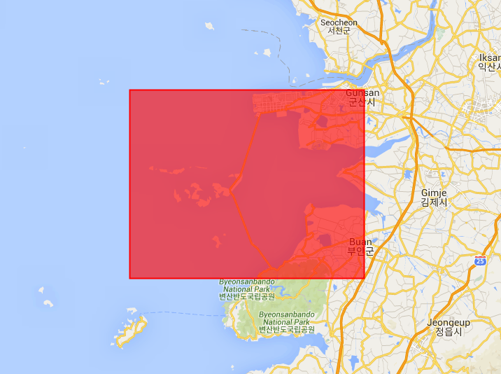

구글어스엔진(GEE)를 이용한 폴리곤 면적 계산하기
====================================
우리는 이전 튜토리얼에서 다룬 GEE 개발환경과 파이썬 API에서 본 바와 같이, 어스엔진은 지리공간 데이터를 매우 강력하고 빠르게 분석하고 시각화할 수 있는 도구다. 이번 튜토리얼은 맵에서 폴리곤을 생성하고, 폴리곤에 해당하는 면적, 둘레 등과 같은 콘솔정보를 계산하고, 출력하는 것에 대해 다룬다.

### 목표
- 지도위에 폴리곤 그리기
- 폴리곤에대한 정보를 계산하고 출력하기

### 준비물
- 구글어스엔 코드편집기 접속

## 폴리곤 생성/그리기

우리의 첫번째 목표는 지도 위에 폴리곤을 생성하고 표출하는 것이다. 새만금 주변해역을 포함하는 폴리곤을 만들어 보자. 어스엔진코드편집기에 다음 코드를 복사해서 붙여보자.

    // 새만금 해역을 포함하는 측지선(geodesic)으로써 폴리곤 생성
    var saemangeum = ee.Geometry.Polygon([
      [[126.28, 35.98], [126.28, 35.68],[126.74, 35.68], [126.74, 35.98], [126.74, 35.98]]
    ]);
    
    // 지도상에 폴리곤 표출
    Map.centerObject(saemangeum);
    Map.addLayer(saemangeum, {color: 'FF0000'}, 'geodesic polygon');

이 스크립트를 실행하면, 지도상에 새만금 해역이 중심에 표출되는 붉은 색의 직사각형을 볼 수 있다.

<figure>
    
    
    <figcaption> 새만금 해역 위에 보이는 폴리곤
    </figcaption>
    
</figure>
 

폴리곤 면적과 둘레 계산하기
코드편집기에서 앞서 실행한 코드 다음에 아래의 코드를 복사하여 붙여 넣는다.
    
    // 제곱 킬로미터로 폴리곤 면적 출력
    print('Polygon area: ', saemangeum.area().divide(1000 * 1000));
    
    // 킬로미터로 폴리곤 둘레 길이 출력
    print('Polygon perimeter: ', saemangeum.perimeter().divide(1000));

이 코드를 실행하면, 면적(km^2)과 둘레(km)에 대한 값이 콘솔에 출력된 것을 볼 수 있다. 어스엔진은 유용한 추가정보 혹은 결과를 제공할 수 있다.

    // GeoJSON 문자열로된 지오메트리 출력
    print('Polygon GeoJSON: ', saemangeum.toGeoJSONString());
    
    // GeoJSON '타입'을 출력
    print('Geometry type: ', saemangeum.type());
    
    // 리스트로 좌표 출력
    print('Polygon coordinates: ', saemangeum.coordinates());
    
    // 지오메토리는 geodesic인지를 출력
    print('Geodesic? ', saemangeum.geodesic());
