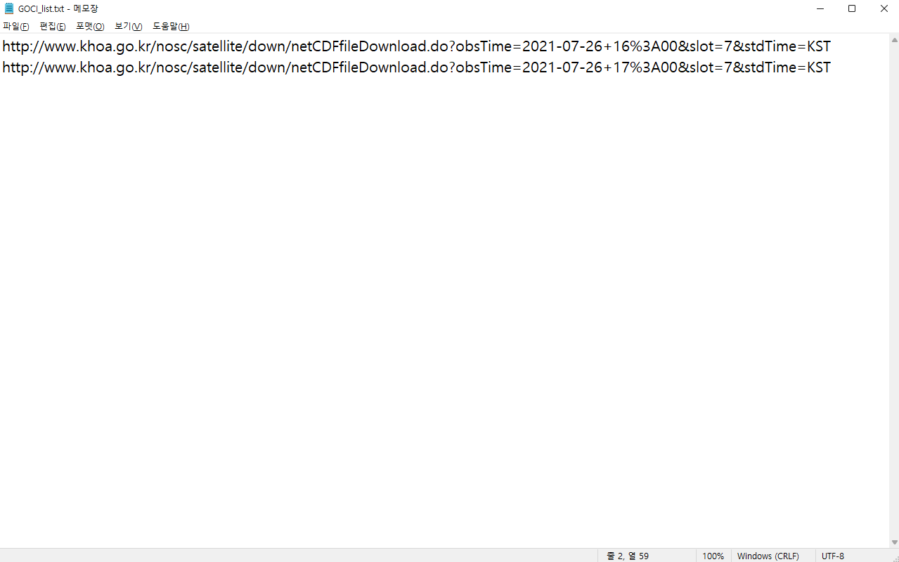
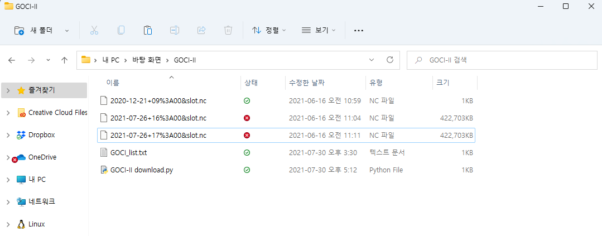

# Python을 이용한 GOCI-II 위성영상 다운로드 방법
<br>
<br>


<br>

[GOCI-II 위성영상 다운로드 방법: 1편 바로가기 링크](http://sealab.kesti.info/view/166)

<br>


1편에서는 [국가해양위성센터](http://www.khoa.go.kr/nosc/intro/noticeList.do)에 접속하여 GOCI-II 영상 다운로드하는 방법을 알아봤습니다. 표준영상(L1B)에서 슬롯을 선택하고(Slot-7) 홈페이지에서 링크를 클릭하여 직접 다운로드하는 방법을 알아봤는데요.
2편에서는 1편 마지막에 `HTML 검사 및 Network 속성`에서 얻은 **다운로드 URL을 활용하는 방법**에 대해 자세히 알아보겠습니다.
<br>
<br>
<br>
<br>
<br>
<br>

### 1. GOCI-II 위성영상 다운로드 URL을 텍스트 형식 파일에 저장하기
<br>



<br>

국가해양위성센터에서 획득한 GOCI-II 위성영상 다운로드 URL을 위 사진처럼 **메모장(텍스트 형식 파일)에 저장합니다.** 자세히 보시면 **튜토리얼 1편의 URL과 다른점**이 하나 보이실텐데요.
URL 중간에 `2021-07-26+16%`과 `2021-07-26+17%`이 서로 다른 것을 확인할 수 있습니다.
<br>
<br>

- GOCI-II 영상 URL은 이처럼 날짜와 시간을 구분하고 있는 것입니다.
- 시간은 08시부터 17시까지 제공하고 있습니다.
- 예를 들어, 7월 25일 8시의 GOCI-II 영상을 다운로드하고 싶다면 `2021-07-25+08%`을 이용하면 됩니다.

---

<br>
<br>
<br>
<br>
<br>

### 2. Python의 requests library를 이용하여 URL 다운받기

<br>

```python
import requests
```

```python
urls = open('GOCI_list.txt', 'r')
```

```python
for i, url in enumerate(urls):
    r = requests.get(url, allow_redirects=True)
    arr = url.split('=')
    open(f'{arr[1]}.nc', 'wb').write(r.content)
```
<br>

위 코드를 이용하면 `2021년 7월 26일 16시와 17시에` 수집된 **L1B Slot-7 GOCI-II 영상**을 받을 수 있습니다. **그 원리를 한 번 이해해볼까요?**

<br>
<br>
<br>


<br>


[Requests](https://docs.python-requests.org/en/v2.9.1/) 라이브러리는 **파이썬으로 HTTP 호출하는 프로그램을 작성할 때** 가장 많이 사용되는 라이브러리입니다. 
파이썬의 패키지 매니저인 pip를 활용해 cmd창에 `pip install requests`를 입력하여 패키지를 설치합니다.

**Requests 라이브러리**는 매우 직관적인 API를 제공하여 HTTP 요청 방식에 따라 다음과 같은 함수를 사용하면 됩니다.
<br>

- GET: `requests.get()`
- POST: `requests.post()`
- PUT: `requests.put()`
- DELETE: `requests.delete()`

<br>

본 튜토리얼에서는 URL을 GET하는 방식을 HTTP로 요청할 것이므로 `requests.get()`만 이해하고, 기억해주시면 됩니다. `import requests`를 통해 code editor에 requests 라이브러리를 불러와주세요.

---

<br>
<br>

이제 **open 함수**를 이용해 GOCI-II 영상 다운로드 URL이 있는 txt 파일을 읽어와보겠습니다. open 함수의 문법은 `f = open('파일명','파일 open type')` 입니다.


```python
urls = open('GOCI_list.txt', 'r')
```

- 파일 open type은 크게 **읽기모드(r), 쓰기모드(w), 추가모드(a)**가 있습니다.
- 우리는 파일을 읽기만 할 것이므로 `'r'`을 사용합니다.
- urls라는 객체에 `GOCI_list.txt` 파일을 열어 읽은 후 저장되게 됩니다.

---

<br>
<br>

마지막으로 **for문**을 이용하여 urls에 할당된 `url(2021-07-26 16시 자료, 2021-07-26 17시 자료)`을 각각 다운받아 **nc 형식의 파일로 저장하는 법**을 해보겠습니다.

```python
for i, url in enumerate(urls):
    r = requests.get(url, allow_redirects=True)
    arr = url.split('=')
    open(f'{arr[1]}.nc', 'wb').write(r.content)
```

- for문의 문법은 `for <원소> in <목록>` 입니다. 목록에는 **list, tuple, string, iterator, generator** 등이 올 수 있습니다.
- 인덱스(index)와 원소를 동시에 접근하면서 루프를 돌릴 수 있는 방법이 바로 **eunemerate** 입니다.
- requests.get을 통해 url을 불러올 수 있으며(다운로드), 문법은 `requests.get(URL 주소, **kwargs)` 입니다.
- **kwargs에 `allow_redirects=True` 옵션을 줄 수 있으며 이를 통해 끊겼을 때 재접속(다운로드)이 가능해집니다.
- url에서 `yyyy-mm-dd+hh`만 추출하여 파일을 저장하고 싶기에 .split을 이용하겠습니다.
- **url.split('=')**을 적용하게 되면, GOCI-II 영상 다운로드 URL은 `http://www.khoa.go.kr/nosc/satellite/down/netCDFfileDownload.do?obsTime`, `2021-07-26+16%3A00&slot`, `7&stdTime`, `KST`로 나뉘게 됩니다.
- 배열은 0부터 시작하므로 1에 해당하는 `2021-07-26+16%3A00&slot`을 저장하기 위해 arr[1]을 사용하며, f'{arr[1]}.nc'는 `2021-07-26+16%3A00&slot.nc`를 의미합니다.
- open.write() 함수를 활용하여 저장해주시면 **python code가 있는 폴더에 GOCI-II 위성영상 다운로드가** 완료됩니다.

---

<br>
<br>
<br>
<br>
<br>

### 3. 다운로드가 완료된 GOCI-II 영상 확인하기

<br>



<br>

위 사진처럼 **code와 URL이 담긴 텍스트 파일**을 한 폴더에 넣고 code editor로 실행시키면 `약 400MB 용량의 GOCI-II 영상 파일`을 얻을 수 있습니다. `용량이 1KB인 경우` **국가해양위성센터에** 자료가 없는 것이니 안심하셔도 됩니다. 

<br>
