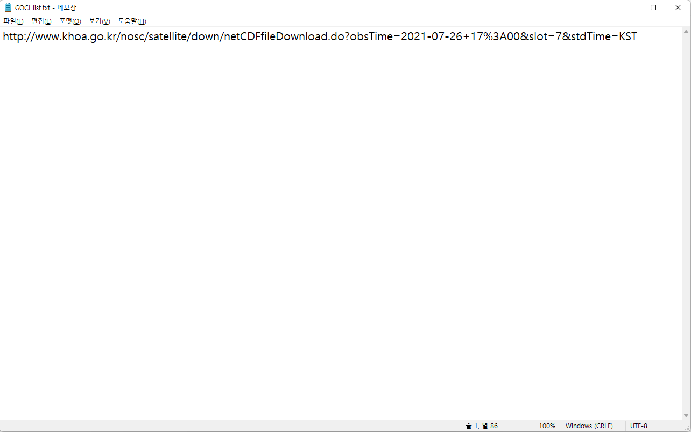

# Python을 이용한 GOCI-II 위성영상 다운로드 방법
<br>
<br>


<br>
<br>


1편에서는 [국가해양위성센터](http://www.khoa.go.kr/nosc/intro/noticeList.do)에 접속하여 GOCI-II 영상 다운로드하는 방법을 알아봤습니다. 표준영상(L1B)에서 슬롯을 선택하고(Slot-7) 홈페이지에서 링크를 클릭하여 직접 다운로드하는 방법을 알아봤는데요.
2편에서는 1편 마지막에 `HTML 검사 및 Network 속성`에서 얻은 **다운로드 URL을 활용하는 방법**에 대해 자세히 알아보겠습니다.
<br>
<br>
<br>
<br>

### 1. GOCI-II 위성영상 다운로드 URL을 텍스트 형식 파일에 저장하기


<br>
국가해양위성센터에서 획득한 GOCI-II 위성영상 다운로드 URL을 위 사진처럼 메모장(텍스트 형식 파일)에 저장합니다.  

<br>
<br>

### 2. Python의 requests library를 이용하여 URL 다운받기
```python
import requests
```

```python
urls = open('GOCI_list.txt', 'r')
```

```python
for i, url in enumerate(urls):
    r = requests.get(url, allow_redirects=True)
    arr = url.split('=')
    open(f'{arr[1]}.nc', 'wb').write(r.content)
```
<br>

### 그럼 이제 코드를 하나씩 이해해볼까요?
<br>

