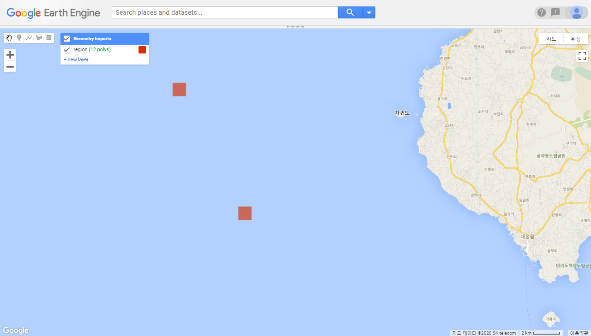
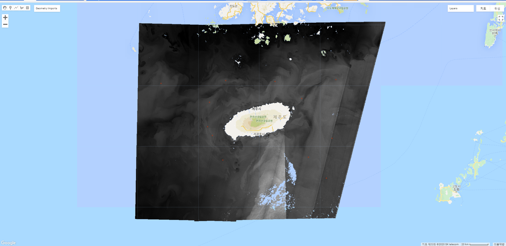
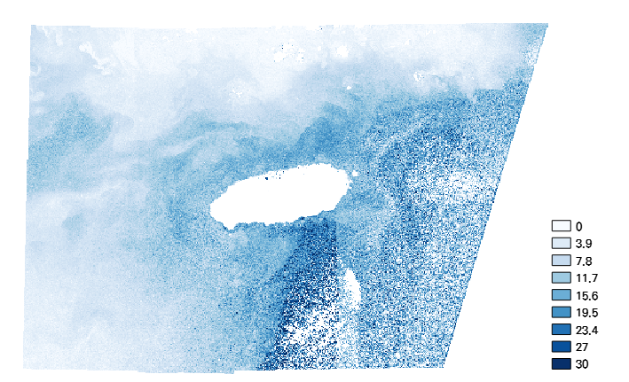

#Google Earth Engine을 이용한 위성영상 수심 생산
===================================

## SDB(Satellite derived bathymetry)

최근 위성영상을 이용하여 생산된 수심 정보의 생산이 증가하고 있다. 아직 정확도는 IHO S-44 기준에 미치지는 못하지만, 수로조사를 계획할 경우나 오래된 측량 자료만 있는 경우 위성영상으로 생산된 수심 정보가 이용된다. 또한 선박을 통한 측량이 어렵고, 수심의 변동이 지속적으로 이루어지는 곳에서 광범위한 영역에 대해 쉽게 수심 정보를 획득할 수도 있다.    
위성영상으로 수심 정보를 생산하는 기법은 해저표면의 형태와 해수면의 상태에 영향을 미칠 수 있으므로 탁도나 해저표면의 구성물질의 영향이 적은 곳을 대상으로 하는 것이 좋다.    
본 튜토리얼은 제주해역을 대상으로하여 위성영상 수심을 생산한다.

## Challenges

1. 영상 촬영 시간이 만조시에 가깝고 구름 오염이 적은 영상이어야 한다.
2. 해양에서는 태양 반사광에 의한 효과(sun glint)가 발생한다.
3. Sentinel-2 영상을 사용하면 제주도가 포함된 영상은 1매가 아닌 여러 영상이다.
4. 수심 생산이기 때문에 육상부는 제거해야 한다.
5. Ratio 알고리즘을 적용하여 수심을 산출한다.

## Methods

### 영상선정 조건

제주도 인근 해역을 포함한 영상을 불러오기 위해 126E, 33N ~ 127E, 33.7N의 영역을 지정하였다. 이 영역은 코드에서 ‘site’라는 변수명으로 사용된다. 

```
var site = ee.Geometry.Polygon([126, 33.7, 126, 33, 127, 33, 127, 33.7], null, false);
```

영상은 2019년 3월 24일 영상을 사용할 것이고, Sentinel-2가 갖고있는 밴드 중 ‘BLUE’, ‘GREEN’, ‘RED’, ‘NIR’, ‘SCL’ 밴드만 사용할 것이므로 해당 밴드만 조회할 수 있도록 'globOptions’ 변수를 만들어준다. 

```
var globOptions = { 
  startDate: '2019-03-24', 
  endDate: '2019-03-25',
  bandSelect: ['blue', 'green', 'red', 'nir', 'SCL'],
  bands: ['B2', 'B3', 'B4', 'B8', 'SCL']
};
```    

### 구름제거

구름제거는 SCL 밴드를 이용하였다. 'cloud_low’, ‘cloud_medium’, ‘cloud_high’, ‘shadow’ 픽셀을 모두 제거하였다.

```
var cld = require('users/fitoprincipe/geetools:cloud_masks')

var maskcloud = function(image) {
  var masked = cld.sclMask(['cloud_low', 'cloud_medium', 'cloud_high', 'shadow'])(image)
  return masked
};
```

### 태양광 반사 보정

해수면에서 발생하는 태양광 반사 보정 식은 다음과 같다.  
<p align="center">
   
</p>
b<sub>i</sub> : 샘플영역 내 NIR 밴드와의 선형 회귀분석 결과로 산출한 기울기     
R<sub>i</sub> : 구하고자 하는 밴드의 전체 픽셀값     
R<sub>NIR</sub> : NIR 밴드의 전체 픽셀값     
MIN<sub>NIR</sub> : 샘플영역 내 NIR 밴드의 최소값       

각 영상에서 샘플 영역을 선택한 후, 위의 식을 적용하면 태양광 반사가 보정된 각 밴드의 픽셀값을 획득할 수 있다. 샘플 영역은 GEE의 사각형 그리기를 이용하여 설정하였다.
   
샘플 영역내 5000개의 픽셀 값을 추출하여 b<sub>i</sub> 산출에 사용하였고, 이 값 중 최소 NIR을 구하였다.
```
// Extract sample data
var sampData = image.sample({
  region: region,
  scale: 10,
  numPixels: 5000,
  geometries: true
})
.map(function(feature) {
  return feature.set('constant', 1);
});

// Calculate minimum NIR
var minNir = ee.Number(sampData.reduceColumns(ee.Reducer.min(), ['nir']).get('min'));
```
BLUE 밴드의 b<sub>i</sub>는 아래와 같이 `ee.Reducer.linearRegression`을 이용하며, 변수 ‘slope_blue’가 BLUE 밴드의 b<sub>i</sub>가 된다.
```
// Linear regression - Blue
var linearRegression_blue = ee.Dictionary(sampData.reduceColumns({
  reducer: ee.Reducer.linearRegression({
    numX: 2,
    numY: 1
  }),
  selectors: ['constant', 'nir', 'blue']
}));

// Conver the coefficients array to a list
var coefList_blue = ee.Array(linearRegression_blue.get('coefficients')).toList();

// Extract the y-intercept and slope
var yInt_blue = ee.Number(ee.List(coefList_blue.get(0)).get(0)); // y-intercept
var slope_blue = ee.Number(ee.List(coefList_blue.get(1)).get(0)); // slope
```
최종적으로 태양광 반사보정은 다음과 같이 수행되었다.
```
// Deglint
var degBlue = image.expression("b('blue')-slope_blue*(b('nir')-minNir)", {
  'slope_blue': slope_blue,
  'minNir': minNir
});
```

### 영상 불러오기
위의 영상선정 조건, 구름제거, 태양광 반사 보정이 수행된 영상을 불러온다. 영상은 Sentinel-2의 Level2 자료를 이용하였으며, 구름량이 10% 미만인 영상만을 조회하였다.
```
var data = ee.ImageCollection("COPERNICUS/S2_SR")
      .filterDate(globOptions.startDate, globOptions.endDate)
      .select(globOptions.bands, globOptions.bandSelect)
      .filterBounds(site)
      .map(maskcloud)
      .filterMetadata('CLOUDY_PIXEL_PERCENTAGE', 'less_than', 10)
      .map(applyDeglint);

// Display
Map.addLayer(data, {bands:['red', 'green', 'blue'], min:0, max:2000}, 'RGB')
```

### 육상 마스킹
육지부 마스킹은 해당영역의 영상을 병합한 후 NDWI>0인 부분을 육상으로 가정하여 제거하였다.
NDWI(Normalized difference water index)는 수분지수 중 하나로 Green 밴드와 NIR 밴드를 이용하여 산출한다.
```
// Calculate NDWI
var applyNDWI = function(image) {
  // apply NDWI to an image
  var ndwi = image.normalizedDifference(['green','nir']);
  return ndwi.select([0], ['ndwi']);
};

// Land Masking
var ndwi = data.map(applyNDWI);
var mosaic_ndwi = ndwi.mosaic();
var land_mask = mosaic_ndwi.gt(0)

var data_mosaic = data.mosaic()
                  .updateMask(land_mask);
```

### Ratio 알고리즘 적용
수심은 Blue 밴드와 Green 밴드의 각각에 자연로그를 취한 영상과 실제 수심자료와 비교를 통해 선형 관계식을 아래와 같이 작성할 수 있다.   
<p align="center">
   
</p>

```
// Calculate ratio
var ratio = data_mosaic.expression(
            'blue / green'
            , {
              'blue': data_mosaic.select('blue').log(),
              'green': data_mosaic.select('green').log()})
            .updateMask(land_mask);
ratio = ratio.select('blue').rename('ratio');

// Extract ratio
var sampData = ratio.select('ratio').sampleRegions({
  collection: depth_Jeju,
  scale: 10,
  geometries: true
}).map(function(feature) {
  return feature.set('constant', 1);
});

// Linear Regression
var linearRegression = ee.Dictionary(sampData.reduceColumns({
  reducer: ee.Reducer.linearRegression({
    numX: 2,
    numY: 1
  }),
  selectors: ['constant', 'ratio', 'Depth']
}));  

// Conver the coefficients array to a list
var coefList = ee.Array(linearRegression.get('coefficients')).toList();

// Extract the y-intercept and slope
var m0 = ee.Number(ee.List(coefList.get(0)).get(0)); // y-intercept
var m1 = ee.Number(ee.List(coefList.get(1)).get(0)); // slope

// Ratio to Depth
var depth = ratio.expression(
            "m1 * b('ratio') + m0"
            , {
              'm0': m0,
              'm1': m1 
});

// Display
Map.addLayer(depth, {min:0, max:50}, 'Depth');
```


### 내보내기
생산된 수심은 Tiff  포맷으로 저장할 수 있다.
```
// Export TIFF
Export.image.toDrive({
  image: depth,
  scale: 10,
  maxPixels: 1e10
});
```     


## Code
[제주지역의 수심을 생산하는 GEE 전체 코드](https://bit.ly/3f7irxK)
