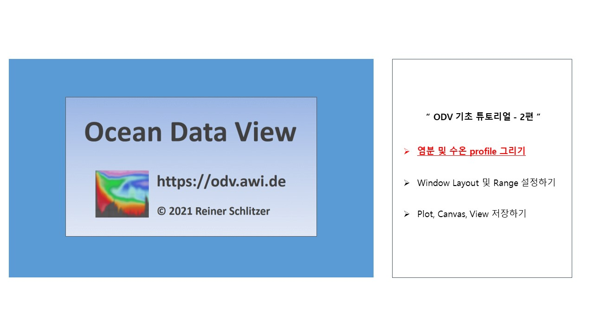

 

# ODV를 활용하여 염분 및 수온 profile 그리기
[ODV 기초 튜토리얼 - 1편 바로가기 링크](http://sealab.kesti.info/view/176)
 
 

1편에서는 [Ocean Data View](https://odv.awi.de/)에 접속하여 회원가입 및 프로그램 설치하는 방법을 알아봤습니다. 더불어, [해양과학자료 리포지토리인 JOISS](https://joiss.kr/)에서 정선해양관측자료를 다운받아 ODV 프로그램에 맞게 포맷을 변환하는 방법을 알아봤는데요.
 

2편에서는 `2000년 정선해양관측자료` 데이터 항목 중 **수온과 염분 항목을 수심에 따라 ODV로 그리는 방법**에 대해 자세히 알아보겠습니다.

