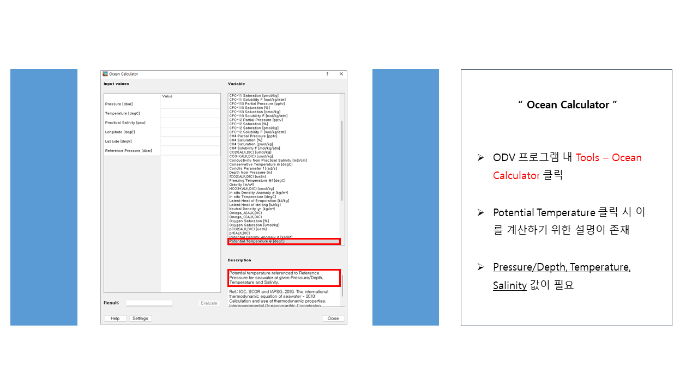

 

# ODV를 활용하여 수온·염분도(T-S diagram) 그리기
[ODV 기초 튜토리얼 - 1편 바로가기 링크](http://sealab.kesti.info/view/176)
 
[ODV 기초 튜토리얼 - 2편 바로가기 링크](http://sealab.kesti.info/view/181)
 
 

1편과 2편은 [ODV](https://odv.awi.de/)를 설치하고, [JOISS](https://joiss.kr/)에서 다운로드 한 정선해양관측자료를 활용하여 수온과 염분 항목을 수심에 따라 ODV로 그리는 방법에 대해 알아봤습니다.
 

3편에서는 `2000년 정선해양관측자료` 데이터를 활용하여 **수온·염분도(T-S diagram) 그리는 방법**에 대해 자세히 알아보겠습니다.

