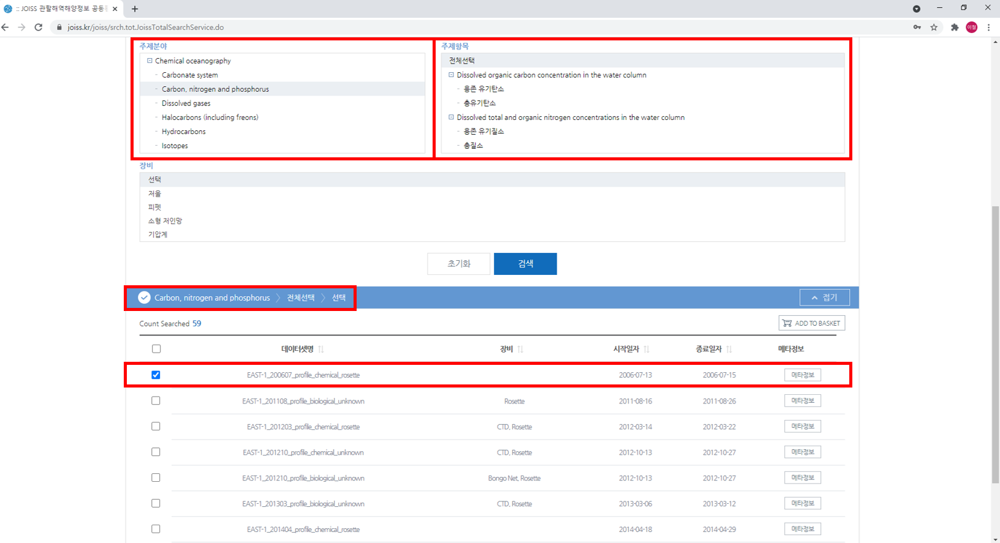

  ### 오늘은 Pyhon을 이용하여 JOISS DB에서 받은 data를 sorting하고 reshape하는 방법을 알아보겠습니다.
 	*본 튜토리얼의 순서는 다음과 같습니다.
 <br>
 
> ### Data collection
>	> Dataset download from JOISS<br>
>	> Identifying format of dataset
> ### Coding
>	> Data preprocessing<br> 
>	> Data sorting<br>
>	> Data reshape
> ### Result
>	> Further study
<br>
<br>

## Data collection
* ### __Dataset download from JOISS__

<br>


<br>

#### 1. 먼저 가공하고 싶은 자료를 DB 사이트에 접속하여 선택합니다.<br>
#### 2. 본 튜토리얼은 해양과학자료를 이용할 것이므로 해양과학자료 공동활용 저장소인 JOISS 사이트에 접속하겠습니다. (링크는 아래에 있습니다)
Link: [JOISS](http://JOISS.kr "JOISS link")
<br>
<br>
<br>
<br>


<br>

#### 3. JOISS 사이트 상단 탭에 [데이터]-[관측자료 검색]을 클릭합니다.
#### 4. 해당 기능을 이용하기 위해선 회원가입 후 로그인을 하셔야 합니다.
<br>
<br>
<br>
<br>


<br>
<br>

<br>

#### 5. 주제분야에서 [Chemical Oceanography]-[Metal and metalloid concentrations]를 클릭합니다.
#### 6. 주제항목은 [전체]를 선택, 장비는 [선택]으로 설정한 후 하단에 [검색] 아이콘을 누릅니다.
#### 7. 총 19개의 검색된 dataset 중 [폐기물 배출해역 조사]로 시작하는 15개의 dataset만 다운로드를 위해 [ADD TO BASEKT]을 클릭합니다. 
<br>
<br>
<br>
<br>



<br>
<br>

<br>

#### 8. 주제분야에서 [Chemical Oceanography]-[Carbon, nitrogen and phosphorus]과 [Carbonate system]를 클릭합니다. 
#### 9. 위 사진에 [빨간색 박스]로 표기된 [EAST-1] 자료를 클릭하여 장바구니로 보냅니다.
    - 이는 다양한 해양과학자료를 한 곳에 모아 data mining을 하기 위해 서로 다른 index를 한 dataset에 모으는 과정입니다.
    - [EAST-1] 자료 중 profile_chemical_rosette 형식으로 된 파일만 다운 받습니다.
    - 검색 시 biological, geochemical, chemical 형식이 동시에 표출되므로, 이를 주의합시다!
<br>
<br>
<br>
<br>


<br>
#### 10. 장바구니에 다운로드하고 싶은 dataset을 모두 넣었다면, JOISS 사이트 우측 최상단에 [장바구니 아이콘]을 클릭합니다.
#### 11. 장바구니에 담긴 dataset 중 다운로드할 항목을 클릭합니다. 이후 다운로드 아이콘을 누릅니다.
#### 12. 여러 개 선택 시 압축파일 형태로 다운로드되니 압축을 풀어 사용하시면 됩니다.
<br>
<br>
<br>
<br>
<br>
<br>

* ### __Identifying format of dataset__

<br>


<br>
#### 1. 다운로드 폴더에 압축을 풀어 dataset이 잘 받아졌는지 확인합니다.
#### 2. 우리가 활용할 csv 파일은 [EAST-1] 자료 5개, [폐기물 배출해역 조사] 자료 15개로 총 20개입니다.
<br>
<br>
<br>
<br>


<br>
#### 3. 임의의 csv 파일을 1개 열어 foramt을 파악합니다.
#### 4. 1열부터 26열까지 메타(META DATA) 정보가 들어가 있고, 27열부터 우리가 사용할 자료(RAW DATA)가 존재합니다.
    - 추후에 Python에서 csv 파일을 불러올 때, META 정보가 있는 26열까지 skip하고 불러올 것이므로 이를 기억해 둡시다!
<br>
<br>
<br>
<br>


## Coding
* ### __Data preprocessing__

<br>

```python
import numpy as np
import pandas as pd
import csv
import os
import glob
import datetime
```

#### 1. 본 튜토리얼에 필요한 Python의 모듈 및 함수를 Editor에 불러오는 코드입니다. (데이터 시각화가 편한 Jupyter notebook을 추천)
#### 2. Pandas는 Python에서 가장 널리 사용되는 데이터 분석 라이브러리로 자세한 설치법은 아래 링크에 있습니다.
Link: [Python library install](http://sealab.kesti.info/view/80 "python library install link")
<br>


```python
sorted(os.listdir('../data/'))
```

#### 3. os.listdir method로 지정한 디렉토리 내 모든 파일과 리스트를 리턴합니다.
#### 4. sorted 함수로 파일을 오름차순으로 정렬합니다. 이는 사업연도별로 raw data를 정리하기 위함입니다.
    - sorted 함수는 숫자, 영어, 한글순으로 파일 이름을 자동 정렬합니다.
    - listdir의 괄호안 경로는 JOISS에서 다운로드 한 csv 파일이 있는 경로로 설정해주시면 됩니다.
    - 본 튜토리얼의 경로인 '../data/'는  code가 있는 파일의 상위폴더와 data 파일이 속한 폴더의 상위폴더가 서로 같음을 의미합니다.
    - code 파일의 경로 -> C:\Users\admin\Documents\jupyter notebook\code
    - data 파일의 경로 -> C:\Users\admin\Documents\jupyter notebook\data
<br>
<br>
<br>
<br>
<br>

* ### __Data sorting__

```python
file_list = glob.glob("../data/*.csv")

list_of_dataframes = []
for filename in file_list:
    list_of_dataframes.append(pd.read_csv(filename, encoding = 'euc-kr', skiprows = 26))
    
merged_df = pd.concat(list_of_dataframes, join = 'outer')
```

#### 1. glob.glob 모듈을 이용하여 경로 내 특정확장자(csv 형식)를 가진 파일을 모두 불러옵니다.
#### 2. pandas는 pd.read_csv, pd.read_excel 등을 통해 data frame 형식으롤 불러올 수 있습니다.
#### 3. for문에서 위 코드를 통해 경로 내 모든 csv 파일을 data frame으로 불러옵니다.
    - 본 튜토리얼은 pd.read_csv('파일경로', encoding = 'euc-kr', skiprows = 26)를 이용하여 csv 파일을 불러왔습니다.
    - 여기서 encoding은 한글의 경우 UTF-8과 EUC-KR을 사용하여 불러올 수 있으며, 둘 중 error code가 안나는 것을 사용하면 됩니다.
    - skiprows는 Identifying format of dataset에서 언급한것 처럼 26열까지 메타 데이터이므로 이를 생략하고 27열부터 불러오는 기능입니다.

#### 4. list.append 함수를 통해 for문에서 불러온 data frame을 list 형태로 저장해줍니다.
#### 5. pd.concat을 통해 여러 data frame을 하나의 합집합 형태의 data frame으로 만들어줍니다.
    - list.append를 지정하지 않으면 for문에서 작업이 끝난 마지막 1개의 data frame만 추출됩니다.
    - 이를 방지하기 위해 for문 앞에 빈 리스트를 설정해주고, for문을 돌며 리스트안에 저장되도록 하는 것입니다.
    - pandas는 concat 기능을 통해 data frame들을 합칠 수 있으며, join = 'outer'를 통해 합집합 형태로 만들 수 있습니다.
<br>
<br>
<br>
<br>
<br>

* ### __Data reshape__
<br>

```python
merged_df
```

<br>
#### 1. Jupyter notebook은 print를 적을 필요없이 변수만 적어도 그 형태를 보여줍니다.
#### 2. 5019 row x 121 columns로 배열이 나온다면 총 20개의 csv 파일이 제대로 합쳐진 것이 맞습니다.
<br>
<br>
<br>
<br>
<br>

```python
merged_df['yyyy-mm-dd hh:mm:ss'] = pd.to_datetime(merged_df['yyyy-mm-dd hh:mm:ss'], format='%Y-%m-%d %H:%M:%S', errors='raise')

merged_df['mon/day/yr'] = merged_df['yyyy-mm-dd hh:mm:ss'].dt.strftime('%m-%d-%Y')
merged_df['hh:mm'] = merged_df['yyyy-mm-dd hh:mm:ss'].dt.strftime('%H:%M')
```

#### 3. 'yyyy-mm-dd hh:mm:ss' 형식으로 된 datetime을 ODV 형식인 mm-dd-YY와 hh:mm 형식으로 바꿔보겠습니다.
#### 4. datetime 모듈을 이용하여 object 타입을 datetime64로 바꿔줍니다. (pd.to_datetime)
#### 5. strftime method를 이용하여 datetime64를 필요한 날짜 형식으로 변환합니다. (dt.df.strftime())
#### 6. 위 코드를 사용하면 121번째 colmun 뒤에 새로운 'mon/day/yr'와 'hh:mm' column이 형성됩니다.
    - 본 튜토리얼은 JOISS에서 받은 dataset을 ODV (Ocean Data View) foramt으로 항목을 일치시키는 것이 튜토리얼의 목적 중 하나입니다.
<br>
<br>
<br>
<br>
<br>

```python
merged_df['Salinity [PSU]'] = (merged_df['염분'] + merged_df['염분[psu]'] + merged_df['염분[‰]'])
```


```python
merged_df['Chl.a[mg/m3]'] = (merged_df['클로로필-a[μg/L]'] + merged_df['클로로필-a[mg/m3]'])
```


```python
merged_df['PCBs[μg/kg]'] = (merged_df['폴리염화바이페닐-28[μg/kg]'] + merged_df['폴리염화바이페닐-52[μg/kg]'] + 
                            merged_df['폴리염화바이페닐-101[μg/kg]'] + merged_df['폴리염화바이페닐-118[μg/kg]'] +
                            merged_df['폴리염화바이페닐-138[μg/kg]'] + merged_df['폴리염화바이페닐-153[μg/kg]'] +
                            merged_df['폴리염화바이페닐-180[μg/kg]'])
```

#### 7. pd.concat을 통해 1개의 data frame으로 합쳐지면서 생긴 '중복된 항목'을 1개의 항목으로 만들어보겠습니다.
    - 염분의 경우 PSU 단위를 쓰며, 3개의 항목이 중복되었습니다.
    - 클로로필의 경우 mg/m3 단위를 쓰며, 단위환산을 하게 되면 ug/L와 같은 단위입니다. 2개의 항목이 중복되었습니다.
    - PCB의 경우 폴리염화바이페닐 뒤에 분자량이 붙으며, 하나씩 쓰기보다 이를 합산하여 PCBs로 표현합니다.
<br>
<br>
<br>
<br>
<br>

```python
merged_df.shape
```

<br>
#### 8. 기존 5019 row x 121 columns 배열을 갖고 있는 data frame에 새로운 항목이 잘 추가되었는지 df.shape를 통해 중간 중간 확인해줍시다.
#### 9. 3번부터 7 과정에서 5개의 column이 새로 생성되었으므로 (5019, 126)이 맞습니다.
<br>
<br>
<br>
<br>
<br>

```python
merged_df.rename(columns = {"project_name":"Cruise", "station":"Station", "bot.depth[m]":"Bot. Depth [m]", "수심(m)":"Depth [m]",
                    "수온[℃]":"Temperature [℃]", "potential density-1000[kg/m3]":"Sigma-t [kg/m3]", "용존산소[mg/L]":"DO[ml/l]",
                            "알칼리도[μmol/kg]":"Alk[μmol/kg]", "수소이온농도[무단위]":"pH", "아질산성 질소 + 질산성 질소[μmol/kg]":
                            "NO2-+NO3-[μmol/kg]", "총질소[wt.%]":"TN", "총인[mg/L]":"TP",  "ISUSnitrate[μg/L]":"ISUS nitrate[μmol/kg]", 
                           "입자성 유기탄소[μg/L]":"POC", "용존 유기탄소[μM]":"DOC", "총유기탄소[mg/L]":"TOC", 
                            "입자성 유기질소[μg/L]":"PON", "부유물질 농도[mg/L]":"SS[mg/L]", "화학적산소요구량[mg/L]":"COD[mg/L]",
                             "투명도[m]":"Transparency[m]", "구리[μg/kg]":"Cu[μg/kg]", "납[μg/kg]":"Pb[μg/kg]", "아연[μg/kg]":
                            "Zn[μg/kg]", "카드뮴[μg/kg]":"Cd[μg/kg]", "6가크롬[μg/kg]":"Cr6+[μg/kg]", "비소[μg/kg]": "As[μg/kg]"},
                            inplace = True)
```

#### 10. 한글로 표시된 항목명(header)을 영어로 바꾸고, 모두 ODV 형식에 맞도록 rename을 해주도록 하겠습니다.
#### 11. df.rename(columns = {"key" : "value"}, inplace = True) 형식으로 되어있으며, key는 기존 항목명, value는 바꾸고 싶은 항목명입니다.
<br>
<br>
<br>
<br>
<br>

```python
df = merged_df.reindex(columns = merged_df.columns.tolist() + ['Type', 'Pontential temperature [℃]', 'DO[μmol/kg]', 'DO saturation(%)'
                                                               , 'DO titration[μmol/kg]' , 'Fluorescence[mg/m3]' , 'PAR[μE/ cm2s1]' , 
                                                               'Cond[S/m]' , 'DIC[μmol/kg]' , 'TEP' , 'PO4-[μmol/kg]' , 'NH4+[μmol/kg]'
                                                               , 'NO2-[μmol/kg]' , 'NO3-[μmol/kg]' , 'SiO4-[μmol/kg]'])
```

#### 12. 기존의 column에 결측값을 갖는 새로운 column들을 추가해보겠습니다.
#### 13. reindex라는 함수를 통해 가능하며, columns = merged_df.columns.tolist() 부분이 기존 column의 목록입니다.
#### 14. 그 뒤에 ['a', 'b', 'c']와 같은 column list를 추가하게 되면 결측값을 데이터로 갖는 새로운 column이 추가됩니다.
<br>
<br>
<br>
<br>
<br>

```python
df = df.fillna('NaN')
```
#### 15. 이제 결측값을 NaN으로 변환해보겠습니다.
#### 16. df.fillna() 라는 함수를 사용합니다. 이 안에 string인 'NaN'을 대입합니다.
    - df.fillna(0)라고 하면 결측값은 모두 0로 바뀝니다.
    - 결측값을 'NaN'으로 설정하지 않고 export할 경우 csv 파일에는 공란으로 나옵니다.
    - 이를 방지하기 위해 string을 직접 입력시키는 것입니다.
<br>
<br>
<br>
<br>
<br>

```python
df = df[['Cruise', 'Station', 'Type', 'mon/day/yr', 'hh:mm', 'Longitude [degrees_east]', 'Latitude [degrees_south]', 'Bot. Depth [m]', 
        'Depth [m]', 'Temperature [℃]', 'Salinity [PSU]', 'Pontential temperature [℃]', 'Sigma-t [kg/m3]', 'DO[μmol/kg]', 
        'DO[ml/l]', 'DO saturation(%)', 'DO titration[μmol/kg]', 'Fluorescence[mg/m3]', 'PAR[μE/ cm2s1]', 'Cond[S/m]', 'Chl.a[mg/m3]', 
        'DIC[μmol/kg]', 'Alk[μmol/kg]', 'pH', 'TEP', 'PO4-[μmol/kg]', 'NH4+[μmol/kg]', 'NO2-[μmol/kg]', 'NO2-+NO3-[μmol/kg]', 
        'NO3-[μmol/kg]', 'SiO4-[μmol/kg]', 'TN', 'TP', 'ISUS nitrate[μmol/kg]', 'POC', 'DOC', 'TOC', 'PON', 'SS[mg/L]', 'COD[mg/L]', 
        'Transparency[m]', 'PCBs[μg/kg]', 'Cu[μg/kg]', 'Pb[μg/kg]', 'Zn[μg/kg]', 'Cd[μg/kg]', 'Cr6+[μg/kg]', 'As[μg/kg]']]
```

#### 17. 기존 data frame에서 원하는 항목명만 추출하여 새로운 data frame을 만들고 싶습니다. 어떻게 해야할까요?
#### 18. 새로운 data frame을 할당한 후에 기존 data frame에서 원하는 칼럼명('header')를 추출하면 됩니다.
#### 19. Column 명은 본 튜토리얼을 보며 직접 입력하다가 오타가 발생할 수 있으니, 복사-붙여넣기를 해주세요!
<br>
<br>
<br>
<br>
<br>

```python
df = pd.DataFrame(df)
```

#### 20. pd.DataFrame()를 이용하여 data frame 형태로 저장해줍니다.
    - Further study에서 그래프화, 시각화를 할 예정이므로 data frame 형태로의 저장이 필수입니다.
<br>
<br>


```python
df.shape
```

<br>
#### 21. 기존의 data frame에서 총 48개의 항목을 추출하였기에 (5019, 48)로 나오면 이상이 없다는 뜻입니다.
<br>
<br>


```python
df.to_csv("../data/JOISS_data_collection.csv", encoding = 'euc-kr')
```
#### 22. df.to_csv("경로 및 파일명", encoding)을 통해 csv 파일로 export 해줍니다.
#### 23. 본 튜토리얼은 JOISS_data_collection.csv로 파일을 저장했습니다.
<br>
<br>
<br>
<br>


## Result
* ### __Further study__

<br>


<br>
<br>


<br>
<br>


<br>
<br>

