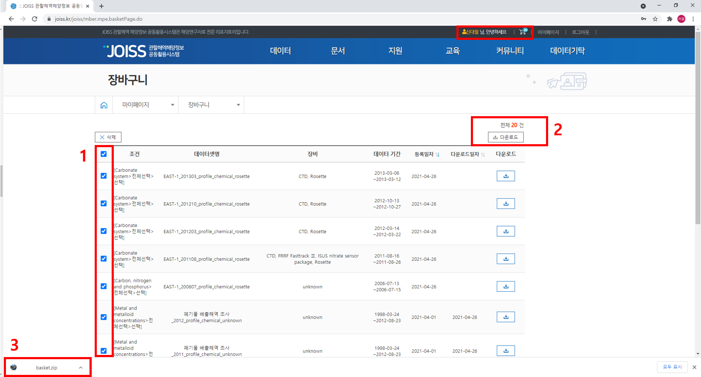

  ### 오늘은 Pyhon을 이용하여 JOISS DB에서 받은 data를 sorting하고 reshape하는 방법을 알아보겠습니다.
 	*본 튜토리얼의 순서는 다음과 같습니다.
  
 
> ### Data collection
>	> Dataset download from JOISS 
>	> Identifying format of dataset
> ### Coding
>	> Data preprocessing  
>	> Data sorting 
>	> Data reshape
> ### Result
>	> Further study
 
 

## Data collection
* __Dataset download from JOISS__

 

 
 

#### 먼저 내가 가공하고 싶은 자료를 DB 사이트에 접속하여 선택합니다. 
#### 우리는 해양과학자료를 이용할 것이므로 JOISS에 접속하겠습니다. (https://joiss.kr)  
 
 

 
 

 
 

 
 

 
 

 
 

 
 

 
 

## Coding
 

<pre>
<code>
import numpy as np
import pandas as pd
import csv
import os
import glob
import datetime
</code>
</pre>

<pre>
<code>
sorted(os.listdir('../data/'))
</code>
</pre>

<pre>
<code>
file_list = glob.glob("../data/*.csv")

list_of_dataframes = []
for filename in file_list:
    list_of_dataframes.append(pd.read_csv(filename, encoding = 'euc-kr', skiprows = 26))
    
merged_df = pd.concat(list_of_dataframes, join = 'outer')
</code>
</pre>

<pre>
<code>
merged_df
</code>
</pre>

<pre>
<code>
merged_df['yyyy-mm-dd hh:mm:ss'] = pd.to_datetime(merged_df['yyyy-mm-dd hh:mm:ss'], format='%Y-%m-%d %H:%M:%S', errors='raise')

merged_df['mon/day/yr'] = merged_df['yyyy-mm-dd hh:mm:ss'].dt.strftime('%m-%d-%Y')
merged_df['hh:mm'] = merged_df['yyyy-mm-dd hh:mm:ss'].dt.strftime('%H:%M')
</code>
</pre>

<pre>
<code>
merged_df.shape
</code>
</pre>

<pre>
<code>
merged_df.rename(columns = {"project_name":"Cruise", "station":"Station", "bot.depth[m]":"Bot. Depth [m]", "수심(m)":"Depth [m]",
                    "수온[℃]":"Temperature [℃]", "potential density-1000[kg/m3]":"Sigma-t [kg/m3]", "용존산소[mg/L]":"DO[ml/l]",
                            "알칼리도[μmol/kg]":"Alk[μmol/kg]", "수소이온농도[무단위]":"pH", "아질산성 질소 + 질산성 질소[μmol/kg]":
                            "NO2-+NO3-[μmol/kg]", "총질소[wt.%]":"TN", "총인[mg/L]":"TP",  "ISUSnitrate[μg/L]":"ISUS nitrate[μmol/kg]", 
                           "입자성 유기탄소[μg/L]":"POC", "용존 유기탄소[μM]":"DOC", "총유기탄소[mg/L]":"TOC", 
                            "입자성 유기질소[μg/L]":"PON", "부유물질 농도[mg/L]":"SS[mg/L]", "화학적산소요구량[mg/L]":"COD[mg/L]",
                             "투명도[m]":"Transparency[m]", "구리[μg/kg]":"Cu[μg/kg]", "납[μg/kg]":"Pb[μg/kg]", "아연[μg/kg]":
                            "Zn[μg/kg]", "카드뮴[μg/kg]":"Cd[μg/kg]", "6가크롬[μg/kg]":"Cr6+[μg/kg]", "비소[μg/kg]": "As[μg/kg]"},
                            inplace = True)
</code>
</pre>

<pre>
<code>
df = merged_df.reindex(columns = merged_df.columns.tolist() + ['Type', 'Pontential temperature [℃]', 'DO[μmol/kg]', 'DO saturation(%)'
                                                               , 'DO titration[μmol/kg]' , 'Fluorescence[mg/m3]' , 'PAR[μE/ cm2s1]' , 
                                                               'Cond[S/m]' , 'DIC[μmol/kg]' , 'TEP' , 'PO4-[μmol/kg]' , 'NH4+[μmol/kg]'
                                                               , 'NO2-[μmol/kg]' , 'NO3-[μmol/kg]' , 'SiO4-[μmol/kg]'])
</code>
</pre>

<pre>
<code>
df = df.fillna(0)
</code>
</pre>

<pre>
<code>
df.shape
</code>
</pre>

<pre>
<code>
df = df[['Cruise', 'Station', 'Type', 'mon/day/yr', 'hh:mm', 'Longitude [degrees_east]', 'Latitude [degrees_south]', 'Bot. Depth [m]', 
        'Depth [m]', 'Temperature [℃]', 'Salinity [PSU]', 'Pontential temperature [℃]', 'Sigma-t [kg/m3]', 'DO[μmol/kg]', 
        'DO[ml/l]', 'DO saturation(%)', 'DO titration[μmol/kg]', 'Fluorescence[mg/m3]', 'PAR[μE/ cm2s1]', 'Cond[S/m]', 'Chl.a[mg/m3]', 
        'DIC[μmol/kg]', 'Alk[μmol/kg]', 'pH', 'TEP', 'PO4-[μmol/kg]', 'NH4+[μmol/kg]', 'NO2-[μmol/kg]', 'NO2-+NO3-[μmol/kg]', 
        'NO3-[μmol/kg]', 'SiO4-[μmol/kg]', 'TN', 'TP', 'ISUS nitrate[μmol/kg]', 'POC', 'DOC', 'TOC', 'PON', 'SS[mg/L]', 'COD[mg/L]', 
        'Transparency[m]', 'PCBs[μg/kg]', 'Cu[μg/kg]', 'Pb[μg/kg]', 'Zn[μg/kg]', 'Cd[μg/kg]', 'Cr6+[μg/kg]', 'As[μg/kg]']]
</code>
</pre>

<pre>
<code>
df = pd.DataFrame(df)
</code>
</pre>

<pre>
<code>
df.shape
</code>
</pre>

<pre>
<code>
df.to_csv("../data/JOISS_data_collection.csv", encoding = 'euc-kr')
</code>
</pre>

test

