------------------------------------------------------------------------

이번 튜토리얼에서는 QGIS 프로그램을 설치하고, csv파일의 위경도 정점을
지도에 띄우는 방법을 설명하고자 한다. 본 튜토리얼에서는 예제파일로
[JOISS](http://joiss.kr) 에서 제공하고 있는 국립수산과학원의 [2017년도
정선해양관측자료 csv
파일](http://joiss.kr/geonetwork/srv/api/records/2f071261-116d-4ee1-be1a-a43bab8f7ee6/attachments/정선해양관측_2017_profile_chemical_unknown.csv)을
사용하였다. 링크를 클릭하면 파일을 바로 다운로드 받을 수 있으며 자료의
상세한 설명은 [JOISS GeoNetwork](http://joiss.kr/geonetwork/)에 들어가면
확인할 수 있다.

튜토리얼 순서는 아래와 같다.

\[목차\]  
1.QGIS 설치하기

2.QGIS에서 csv파일 불러오기

3.QGIS point 색 변경하기

4.QGIS 지도 설치하기

 

QGIS 설치하기
-------------

------------------------------------------------------------------------

QGIS는 오픈소스 지리정보 시스템으로 래스터 및 벡터데이터 포맷을 지원하며
PostGIS, MS SQL Spqtial 등을 연결하는 등 벡터분석, 샘플링, 공간처리,
도형 및 데이터베이스 관리 도구를 제공하고 있다. 뿐만 아니라 플러그인을
통해 기능을 확장시킬 수 있다.  
  QGIS 사용을 하기 위해 다운로드 및 설치를 진행해보도록 하겠다.
[QGIS 홈페이지의 다운로드
페이지](https://qgis.org/ko/site/forusers/download.html)에 접속하여
사용하고 있는 OS와 시스템 종류에 맞추어 설치 파일을 클릭한다.

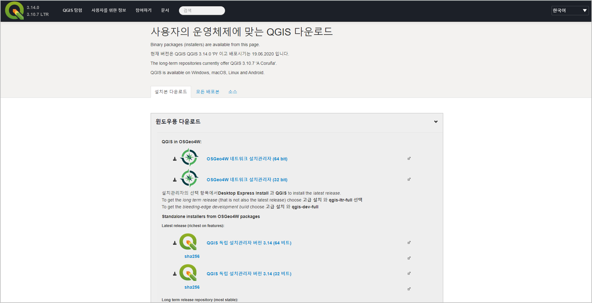

 

다운로드가 완료되었다면 설치 실행을 하여 설치 경로와 설치 구성을 선택 후
진행하면 설치가 완료된다.

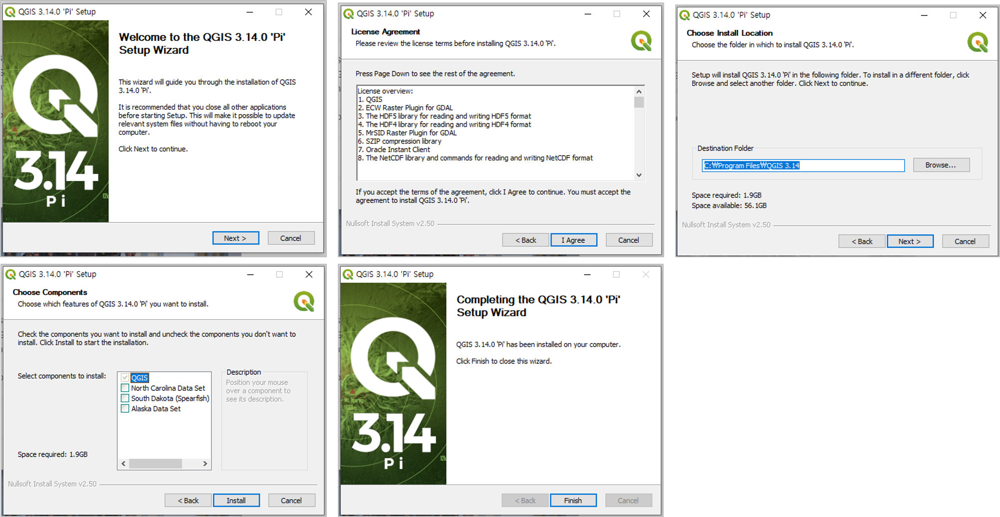

   

QGIS에서 csv파일 불러오기
-------------------------

------------------------------------------------------------------------

QGIS 설치가 완료되었다면 [2017년도 정선해양관측자료 csv
파일](http://joiss.kr/geonetwork/srv/api/records/2f071261-116d-4ee1-be1a-a43bab8f7ee6/attachments/정선해양관측_2017_profile_chemical_unknown.csv)을
불러와 조사정점을 표시해 보도록 하겠다. 해당 링크를 클릭하면 예제
csv파일을 바로 다운로드 할 수 있다.

먼저, 상단 메뉴 중 레이어 → 레이어 추가를 선택 후 csv파일을 불러오기
위해 ’구분자로 분리된 텍스트 레이어 추가’를 클릭한다.

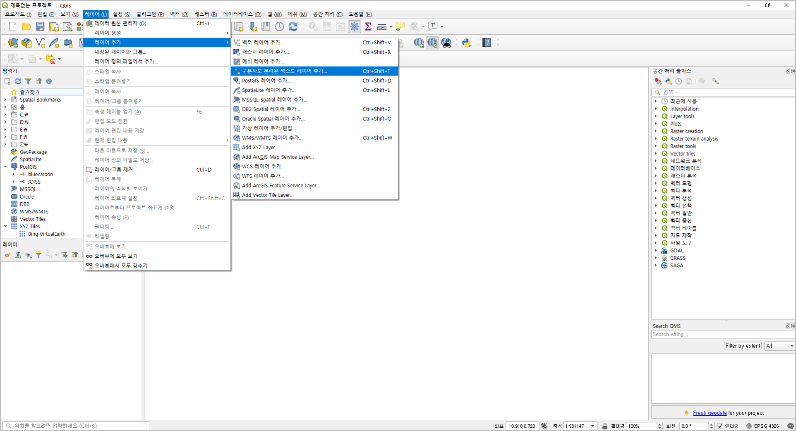

   
다운로드 된 정선해양관측 2017년도 파일을 불러오고, 인코딩을 ‘EUC-KR’로
변경 후 ’파일 포맷’에서 csv을 선택한다. JOISS에서 제공하는 데이터 셋의
경우 데이터 상단에 메타데이터를 포함하고 있으므로
`무시할 머리글 행의 수`에 메타데이터에 해당하는 26을 입력한 후,
메타데이터를 제외한 첫번째 레코드를 필드 이름으로 지정한다. ’도형정의’
탭의 포인트 좌표에서 x축, y축에 해당하는 위경도 컬럼을 지정한 후 도형
좌표계를 선택해야 한다.

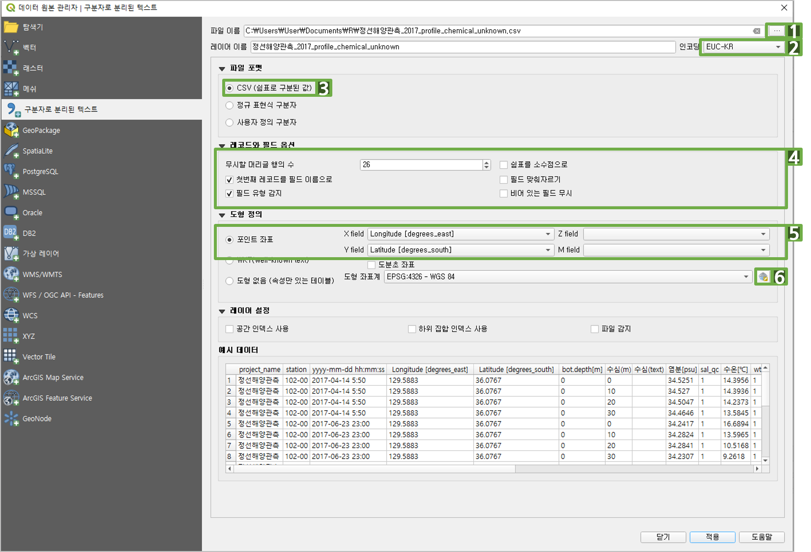

  JOISS에서 제공하는 데이터셋의 위경도는 WGS84 좌표계를 사용하고
있기 때문에 `좌표계 선택`창에서 WGS 84를 검색하여 도형 좌표계를
설정해준다.

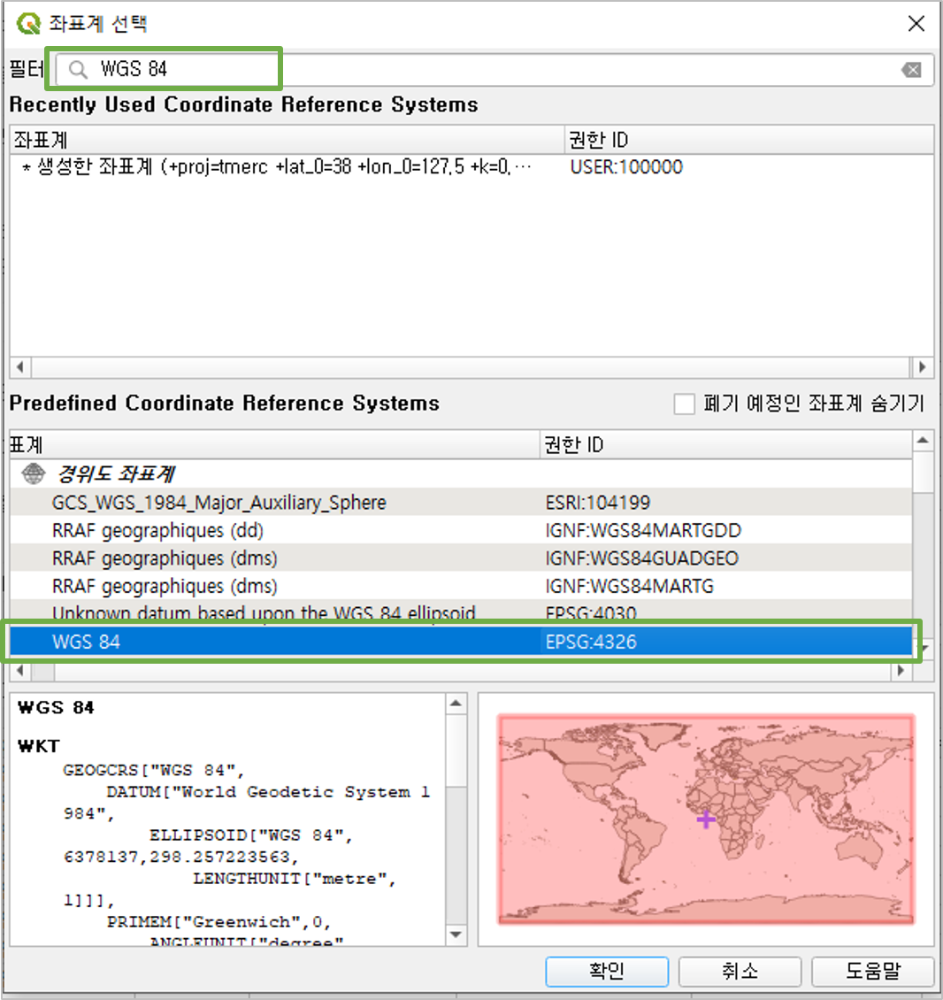

  이제 `적용`버튼을 클릭 후 `닫기`를 누르면, 정선해양관측 포인트
레이어 생성과 함께 QGIS 화면에 정점들이 표시된 것을 확인할 수 있다.

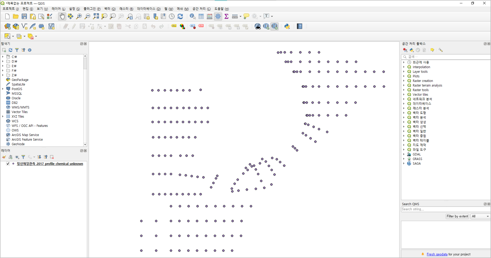

  레이어에서 마우스 오른쪽 클릭을 한 후 `속성 테이블 열기`를
클릭하면 정선해양관측자료의 테이블을 확인할 수 있다.

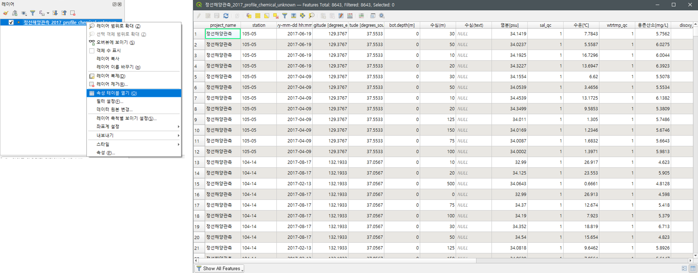

   

QGIS point 색 변경하기
----------------------

------------------------------------------------------------------------

이제, 포인트 레이어의 색을 변경하는 방법에 대해 알아보도록 하겠다.

  우선, 레이어에서 마우스 오른쪽 클릭을 한 후에 `속성`에 들어간 후,
좌측의 3번째 아이콘인 `객체 심볼 조정`을 클릭한다.  
맨 위의 옵션 선택 버튼에서 `분류값 사용`으로 변경하고 ’station’에 따라
색을 표출 하기 위해 `값`에는 ’station’을 클릭한다. `심볼`에는 표출된
정점 모양을 변경할 수 있고, `색상 램프`를 사용하여 표출될 색상을 선택할
수 있다. 마지막으로 좌측 하단의 `분류`버튼을 누르게되면 station에 따라
색이 정해진것을 확인할 수 있으며 `적용` 버튼을 클릭 수 `확인`버튼을
누르면 정점마다 색이 변경된것을 확인할 수 있다.

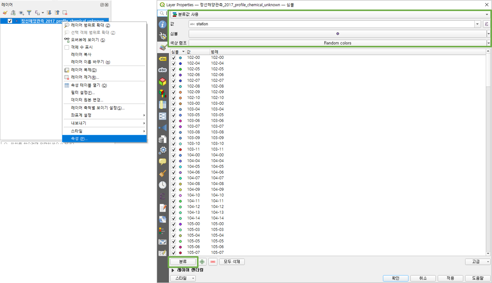

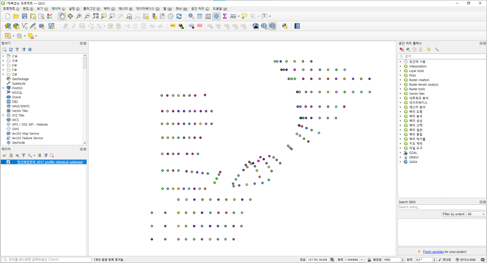

  이번엔, 정선해양관측자료의 정선 라인 별 색을 변경하는 방법에 대해
설명하겠다. 정선해양관측자료의 경우 station컬럼에 ’정선번호-정점번호’의
형태로 제공되고 있는데, QGIS의 표현식 기능을 사용하면 정선 컬럼을 따로
생성하지 않고 정선 별 구분이 가능하다.

station 컬럼에서 정선번호만 구분하기 위해서는 아까와 같이 레이어
속성정보 → `객체 심볼 조정`에 들어간 후 `값` 선택의 우측에 `Ԑ`버튼을
클릭하여 `표현식 대화창`에 함수를 입력하면 된다. 정선번호는 station
왼쪽에서 3번째까지의 값에 해당하므로 함수 입력창에 ’left(station, 3)’을
입력 후에 다시 한 번 분류를 클릭하면 정선별로 색이 지정된것을 확인할 수
있다.

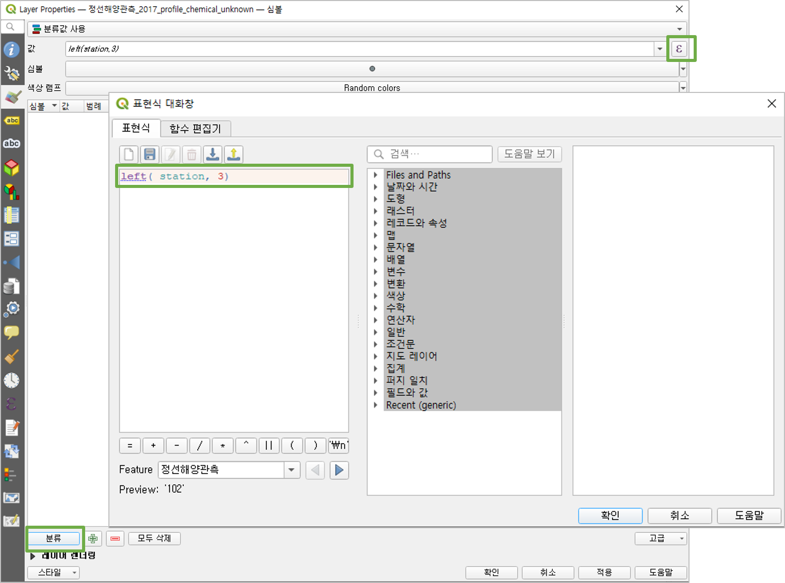

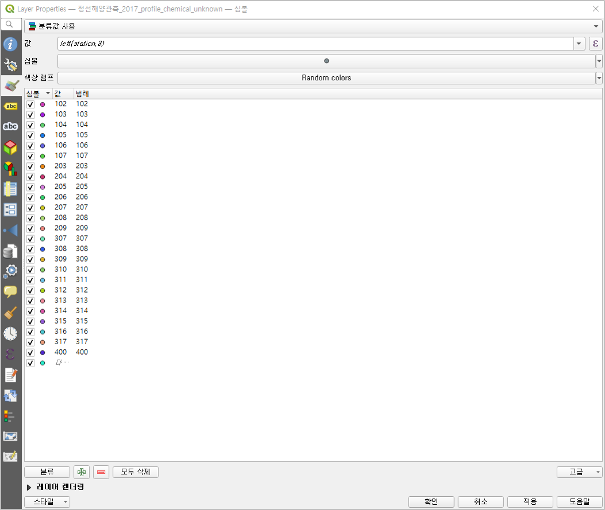

  이제 `적용`버튼을 클릭 후 `닫기`를 누르면 모든 정점이 색이 달랐던
아까와 달리, 정선별로 색이 같은것을 확인할 수 있다.

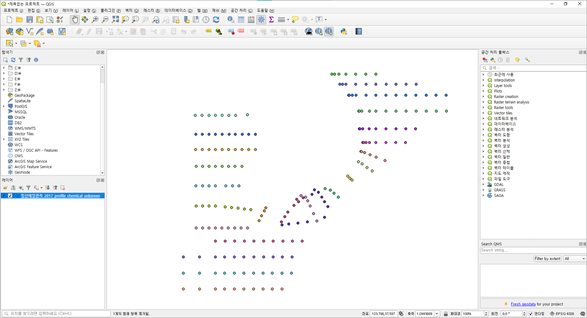

   

QGIS 지도 설치하기
------------------

------------------------------------------------------------------------

이번엔 정점 뒤에 우리나라 지도를 함께 띄워보도록 하겠다. QGIS에서 지도를
표출하기 위해서는 플러그인 기능을 사용하여 지도를 다운로드 해야한다.  
상단의 `플러그인`메뉴의 `플러그인 관리 및 설치`를 누르면 설치 창이
뜨는데, 검색창에 ’tms’를 검색 후 ’QuickMapServices’를 클릭하여
`플러그인 설치`를 누른다.

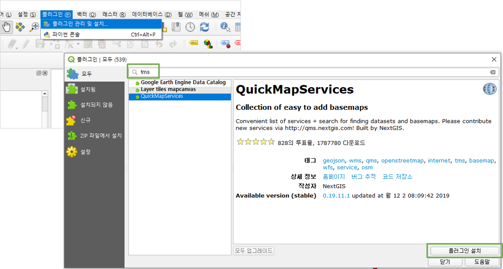

  설치가 완료되었다면 상단의

메뉴의 `Settings`에 들어간다. ’More services’탭에서 ’Get contributed
pack’을 클릭 후 ’Visibility’탭에서 ’Visible’의 체크박스를 체크하고
`저장`을 누른다.  
설치된 지도는 상단의 `웹`메뉴의 `QuickMapServices`에서 확인할 수 있다.

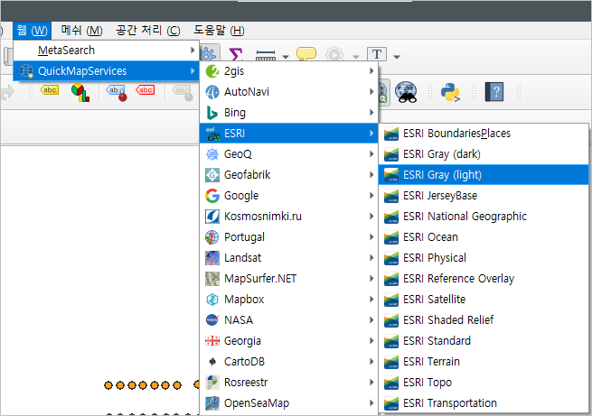

  설치된 지도 중 ’ESRI’의 ’ESRI GRAY (light)’지도를 띄워보겠다. 처음
지도를 불러오면, 먼저 띄워둔 정점이 사라지는데, 이때는 좌측 하단의
레이어 탭에 지도 레이어를 정점 레이어의 밑으로 옮겨주어야 한다. 레이어의
순서를 변경할 때에는 마우스로 클릭한 상태에서 움직이면 된다. 레이어
순서에 따라 레이어가 표출되기 때문에 항상 유의해야 한다.

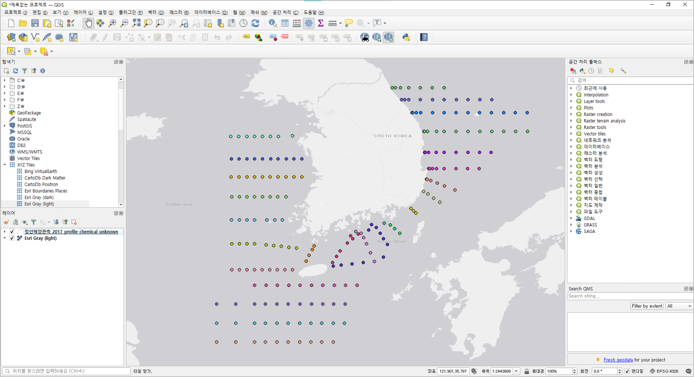

    이상으로 ‘QGIS 설치 및 csv파일 불러오기’ 튜토리얼을 마치도록
하겠다.
