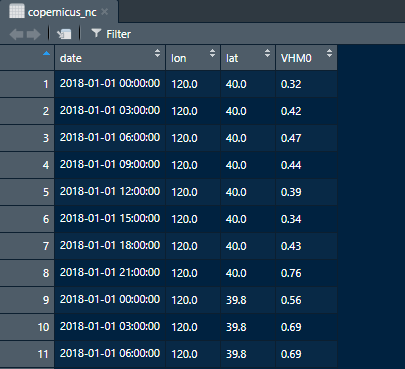

<!-- 첫 h1 이전 라인은 씨랩 본문에서 보이지 않게 설정하였습니다. -->
<!-- 첫 h1이 씨랩 글제목이 됩니다. 블럭 아닌 구간에서 샵(#) 하나 = 헤딩1(h1) -->
#R을 이용한 NetCDF 데이터 확인하기
------------------------------------------------------------------------

이번 튜토리얼에서는 R프로그램을 활용하여 NetCDF 포맷의 그리드자료를
데이터 프레임 형태로 변환하여 데이터를 확인하는 방법을 알아보려고 한다.
데이터 프레임은 스프레드시트 형식으로 보여지기 때문에 데이터를 확인하고
변형하는데 용이하고, 그래프를 그리는데 편리하다는 장점이 있다. 이
튜토리얼의 순서는 아래와 같다.

\[목차\]  
1. NetCDF파일이란  
2. R Studio에서 nc파일 열기  
3. 데이터 프레임에 nc파일 데이터 저장하기

------------------------------------------------------------------------

NetCDF파일이란
--------------

우선, NetCDF(이하 nc)파일이란 Network Common Data Form의 약자로,
기후/기상학 및 해양학에서 많이 사용되는 파일이다. 위도, 경도, 시간 등의
항목을 갖는 n차원의 배열 형태로 이루어져 있으며 파일 내에 데이터와
데이터에 대한 정보가 포함된다. nc파일을 사용하면 많은 양의 데이터를 적은
용량으로 저장할 수 있다는 장점이 있다.

아래 그림은 nc파일 구조를 도식화한 그림으로, 여러 변수를 관측한
해양데이터의 경우엔 각 변수 항목 별로 위도, 경도, 수심을 갖는 데이터를
시계열 형태로 구성할 수 있다. 이 뿐만 아니라 nc파일은 정점관측자료,
시계열자료, 그리드자료, 위성 및 레이더 관측자료 등 사용자가 원하는
다양한 유형으로 데이터를 저장할 수 있다.


<table>
<colgroup>
<col style="width: 17%" />
<col style="width: 41%" />
<col style="width: 41%" />
</colgroup>
<thead>
<tr class="header">
<th style="text-align: center;">nc파일 유형</th>
<th style="text-align: left;">기술</th>
<th style="text-align: left;">해양 데이터 예시</th>
</tr>
</thead>
<tbody>
<tr class="odd">
<td style="text-align: center;">point</td>
<td style="text-align: left;">단일 포인트 데이터<br>(다른 포인트와의 암시적 좌표 관계가 없음)</td>
<td style="text-align: left;">- 시간적 또는 공간적 관계가 없는 하나 이상의 관측데이터</td>
</tr>
<tr class="even">
<td style="text-align: center;">timeSeries</td>
<td style="text-align: left;">시간의 경과에 따라 동일한 위치에서 관측된 데이터</td>
<td style="text-align: left;">- 시간의 경과에 따라 하나 이상의 고정 플랫폼에서 관측된 데이터</td>
</tr>
<tr class="odd">
<td style="text-align: center;">trajectory</td>
<td style="text-align: left;">일정한 시간동안 궤적을 따라 이동하는 포인트 데이터</td>
<td style="text-align: left;">- 진행중(underway)인 플랫폼에 설치된 TSG(Thermosalinograph)로 부터 측정된 데이터</td>
</tr>
<tr class="even">
<td style="text-align: center;">profile</td>
<td style="text-align: left;">고정된 위치 및 시간에서 수직으로 관측된 데이터</td>
<td style="text-align: left;">- 동일한 깊이 (z) 값을 갖거나 갖지 않는 CTD데이터 또는 XBT 캐스트 데이터 (같은 깊이 레벨을 가질 필요는 없음).</td>
</tr>
<tr class="odd">
<td style="text-align: center;">trajectoryProfile</td>
<td style="text-align: left;">궤적을 따라 정렬된 지점에 위치한 프로파일 데이터 셋</td>
<td style="text-align: left;">- 수심이 입력된 글라이더, Argo floats</td>
</tr>
<tr class="even">
<td style="text-align: center;">swath</td>
<td style="text-align: left;">센서 좌표의 데이터 배열</td>
<td style="text-align: left;">- 레벨 2 극궤도 위성 데이터</td>
</tr>
<tr class="odd">
<td style="text-align: center;">grid</td>
<td style="text-align: left;">규칙적 또는 불규칙적인 그리드에 표현되거나 투영된 데이터 셋</td>
<td style="text-align: left;">- 1도의 해상도를 갖는 염분 분석 데이터 등</td>
</tr>
</tbody>
</table>

\<출처 : [NODC NetCDF
Templates](https://www.nodc.noaa.gov/data/formats/netcdf/v1.1/)\>

------------------------------------------------------------------------

R Studio에서 nc파일 열기
------------------------

#### nc파일 정보 확인하기

R과 R Studio 프로그램이 설치되어있지 않은 사용자는 JOISS포털의
[R튜토리얼-R다운로드 및
설치](http://joiss.kr/joiss/cont.tuto.rTutoList.do)를 참고하길 바란다.

본 튜토리얼에서는 예제파일로
[코페르니쿠스](https://resources.marine.copernicus.eu/?option=com_csw&task=results)에서
제공하는 [파랑 재분석
자료](https://resources.marine.copernicus.eu/?option=com_csw&view=details&product_id=GLOBAL_REANALYSIS_WAV_001_032)를
이용하였다.  
해당 자료는 1993년부터 2018년까지의 전지구적 범위의 파랑 재분석 자료를
NetCDF4 포맷으로 제공하는 자료로, 이 중 일부 항목 데이터를 다운로드하여
사용하였다.

R Studio에서 nc파일을 불러오기 위해서는
[`ncdf4`](https://www.rdocumentation.org/packages/ncdf4/versions/1.17/topics/ncdf4-package)
패키지를 설치하고 선언해야한다. 그리고 `setwd()`함수를 이용하여 예제
nc파일이 저장된 경로를 설정 후
[`nc_open`](https://www.rdocumentation.org/packages/ncdf4/versions/1.17/topics/nc_open)함수로
예제 nc파일을 불러와 변수`nc_cop`에 저장한다. 변수 `nc_cop`에 저장된
변수항목들은
[`attributes`](https://www.rdocumentation.org/packages/base/versions/3.6.2/topics/attributes)함수를
이용하면 확인할 수 있다.

``` r
#ncdf4 패키지 설치
install.packages("ncdf4")
```

``` r
#ncdf4 라이브러리 선언
library(ncdf4) 
#파일이 저장되어있는 경로 설정
setwd("C:/Users/User/Desktop/copernicus/")
# 'nc_open()'함수를 이용하여 변수 'nc_cop'에 nc파일 저장
nc_cop <- nc_open("global-reanalysis-wav-001-032_all_20180101.nc")
#변수항목 확인
attributes(nc_cop$var)
```

    ## $names
    ##  [1] "VHM0_WW"   "VMDR_SW2"  "VTM10"     "VMDR"      "VMDR_SW1" 
    ##  [6] "VPED"      "VTPK"      "VTM02"     "VMDR_WW"   "VHM0_SW1" 
    ## [11] "VTM01_SW2" "VSDX"      "VTM01_SW1" "VSDY"      "VHM0"     
    ## [16] "VTM01_WW"  "VHM0_SW2"

해당 nc파일에는 17개의 변수항목이 들어있는것을 확인할 수 있다.

`print`함수를 이용하여 설명정보(메타 데이터)를 확인해보자. 설명정보에
따르면, 17개 변수항목(유의파고, 파주기 등)과 단위, 차원들(위도, 경도,
시간)의 크기와 범위, 33개의 부가정보를 보여준다.

``` r
print(nc_cop)
```

nc파일의 데이터를 가져올때는
[`ncvar_get()`](https://www.rdocumentation.org/packages/ncdf4/versions/1.17/topics/ncvar_get)함수를
이용하여 nc파일의 위도, 경도, 시간, 파고 등 가져올 항목을 지정할 수
있다.  
`lat`, `lon` 변수에 nc파일의 위도, 경도 데이터를 저장하여 확인해보자.

``` r
lat <- ncvar_get(nc_cop, "latitude")
lon <- ncvar_get(nc_cop, "longitude")
```

``` r
lat
lon
```

자료 확인 결과 위도는 89.8˚ 부터 -89.8˚ 까지, 경도는 -180˚ 부터 179.8˚
범위의 배열을 갖고 있는 0.2˚ 간격 그리드 자료임을 알 수 있다.

이번엔 `nc_time` 변수에 nc파일의 time 데이터를 저장하여 확인해보자.

``` r
nc_time <- ncvar_get(nc_cop, "time")
nc_time
```

    ## [1] 596088 596091 596094 596097 596100 596103 596106 596109

nc파일의 시간을 UTC날짜 형식으로 변환하는
[`utcal.nc()`](https://www.rdocumentation.org/packages/RNetCDF/versions/2.1-1/topics/utcal.nc)함수를
사용하기 위해
[`RNetCDF`](https://www.rdocumentation.org/packages/RNetCDF/versions/2.1-1)패키지를
설치하고 선언해야한다. `utcal.nc`함수는 time과
[`ncatt_get()`](https://www.rdocumentation.org/packages/ncdf4/versions/1.17/topics/ncatt_get)함수를
이용해 불러온 time변수항목의 속성인 units을 이용하여 날짜를 변환한다.
`utcal.nc()`함수의 `type`을 변경하면 날짜 표출 방식을 변경할 수 있다.

``` r
#RNetCDF 패키지 설치
install.packages("RNetCDF")
```

``` r
library(RNetCDF)
#시간 변수 내 units 저장
time_unit <- ncatt_get(nc_cop, "time")$units 
# 'utcal.nc()'함수를 이용하여 nc파일의 날짜형식 변경
time_cop <- utcal.nc(time_unit, nc_time, type= "c")
time_cop
```

    ## [1] "2018-01-01 00:00:00 UTC" "2018-01-01 03:00:00 UTC"
    ## [3] "2018-01-01 06:00:00 UTC" "2018-01-01 09:00:00 UTC"
    ## [5] "2018-01-01 12:00:00 UTC" "2018-01-01 15:00:00 UTC"
    ## [7] "2018-01-01 18:00:00 UTC" "2018-01-01 21:00:00 UTC"

자료 확인 결과 2018년 1월 1일 0시 부터 21시까지의 데이터가 3시간
간격으로 있음을 알 수 있다.

마지막으로 `dat_VHMO` 변수에 VHM0(유의파고) 데이터를 저장하여
확인해보자.

``` r
dat_VHMO <- ncvar_get(nc_cop, "VHM0")
dat_VHMO
```

동일한 방법으로 새로운 변수에 유의파고(VHMO) 외에 다른 항목을 저장하면
해당 항목의 데이터를 확인할 수 있다.

------------------------------------------------------------------------

#### 데이터 프레임에 nc파일 데이터 저장하기

앞서 nc파일 데이터를 확인하기 위해 변수에 저장한 시간, 위도, 경도
VHM0데이터를 우리나라 주변해역의 데이터만 추출하여 데이터 프레임에
저장해보자. 튜토리얼에서 사용된 범위는 30˚N, 50˚N, 120˚E, 140˚E에
해당하는 범위를 사용하였다.

nc파일에서 해당 위경도의 배열을 알아보자.

``` r
lat[300]  # 300번째 배열 위도 확인하기
```

    ## [1] 30

``` r
lat[200]  # 200번째 배열 위도 확인하기
```

    ## [1] 50

``` r
lon[1501] # 1501번째 배열 경도 확인하기
```

    ## [1] 120

``` r
lon[1601] # 1601번째 배열 경도 확인하기
```

    ## [1] 140

30˚N, 50˚N에 해당하는 nc파일의 위도배열은 각각 300행과 200행이고, 120˚E,
140˚E에 해당하는 위도배열은 1501행, 1601행임을 알 수 있다.

확인한 위도, 경도 배열을 가지고 `for()`문을 이용하여 nc파일의 데이터를
데이터프레임에 저장해보자. 데이터 테이블을 생성하기 위해서는
[`dplyr`](https://www.rdocumentation.org/packages/dplyr/versions/0.7.8/topics/dplyr-package)패키지를
설치하고 선언 해야하며
[`data_frame()`](https://www.rdocumentation.org/packages/functionMap/versions/1.0.0/topics/data_frame)
함수를 이용하여 데이터 테이블의 프레임을 만든 후 데이터를 저장할 수
있다. nc파일의 데이터를 불러올 시에는 dimension에 맞춰 불러와야하며
dimension은 nc파일 메타정보의 short 변수명 옆에 적혀있다. dimension이
일치하지 않을 경우에는 오류가 발생할 수 있다.

``` r
#dplyr 패키지 설치
install.packages("dplyr")
```

``` r
library(dplyr)

#비어있는 데이터 테이블 생성
c_nc_table <- NULL
N_remove <- NULL
c_nc_remove <- NULL
copernicus_nc <- NULL

for(i in 1501:1601){  # i : lon 행 범위(120˚~140˚)에 해당하는 배열 입력
  for(j in 200:300){ # j : lat 행 범위(30˚~50˚)에 해당하는 배열 입력    
    #시간, 경도, 위도, 데이터 순서로 데이터 테이블 생성
    c_nc_table <- data_frame(date=time_cop, lon=lon[i], lat=lat[j], VHM0=dat_VHMO[i,j,])  
    ## NA값 제거
    N_remove <- filter(c_nc_table, VHM0 != "") %>% filter(VHM0 != "NA") 
    #데이터 프레임 합치기
    c_nc_remove = rbind(c_nc_remove, N_remove)
    #새로운 데이터를 담기위해 기존의 데이터 테이블을 NULL로 지정
    c_nc_table = NULL 
    N_remove=NULL
  }
  copernicus_nc = rbind(copernicus_nc, c_nc_remove)
  #새로운 데이터를 담기위해 기존의 데이터 테이블을 NULL로 지정
  c_nc_remove = NULL 
}
```

작업이 완료되었다면, 아래의 코드를 실행시켜 데이터 테이블에서 데이터를
확인할 수 있다.

``` r
View(copernicus_nc)
```


