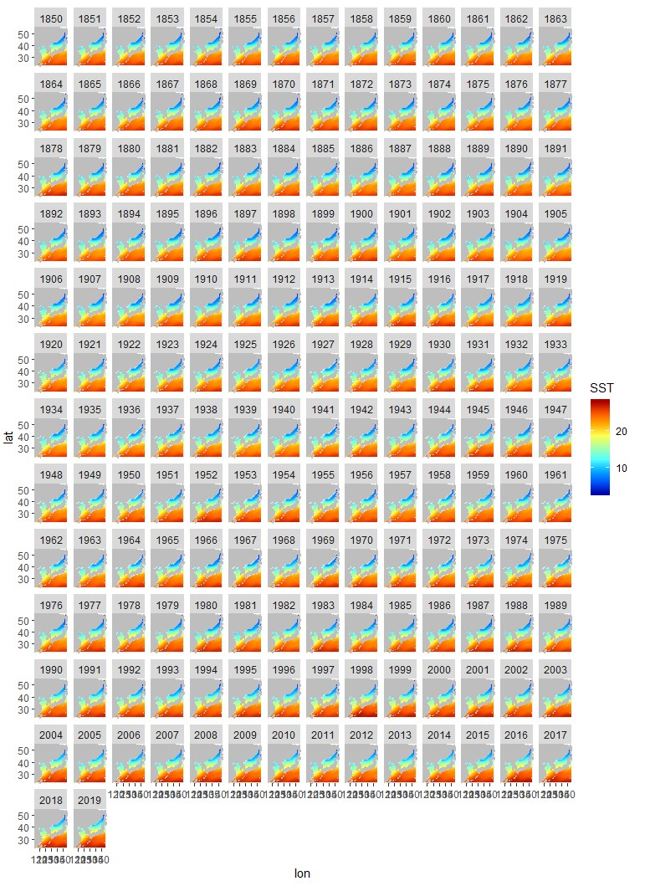

#R을 이용한 데이터프레임 셋 래스터그리기

<!-- 첫 h1 이전 라인은 씨랩 본문에서 보이지 않게 설정하였습니다. -->
<!-- 첫 h1이 씨랩 글제목이 됩니다. 블럭 아닌 구간에서 샵(#) 하나 = 헤딩1(h1) -->  

------------------------------------------------------------------------

이번 튜토리얼에서는 데이터프레임의 형태로 저장된 데이터로 래스터 그리는 방법을 설명하고자 한다.

본 튜토리얼에서는 예제파일로 NOAA에서 제공하고 있는 [COBE-SST2](https://psl.noaa.gov/data/gridded/data.cobe2.html) nc파일의 표층수온자료를 이용하여 연도별 표층수온 변화를 래스터로 확인해보자.

튜토리얼 순서는 아래와 같다.

\[목차\]  

1.래스터 그리기

2.연도 별 래스터 그리기

3.애니메이션 만들기

------------------------------------------------------------------------

nc파일 데이터를 데이터프레임 형태로 변환하는 방법은 'R을 이용한 NetCDF 데이터 확인하기 튜토리얼'을 참고하기 바란다.

``` r

cobe

```

    ## # A tibble: 852,720 x 4
    ##    date                  lon   lat   SST
    ##    <dttm>              <dbl> <dbl> <dbl>
    ##  1 1850-01-01 00:00:00  118.  23.5  17.2
    ##  2 1850-02-01 00:00:00  118.  23.5  17.2
    ##  3 1850-03-01 00:00:00  118.  23.5  18.8
    ##  4 1850-04-01 00:00:00  118.  23.5  21.0
    ##  5 1850-05-01 00:00:00  118.  23.5  23.6
    ##  6 1850-06-01 00:00:00  118.  23.5  25.9
    ##  7 1850-07-01 00:00:00  118.  23.5  27.1
    ##  8 1850-08-01 00:00:00  118.  23.5  27.2
    ##  9 1850-09-01 00:00:00  118.  23.5  26.9
    ## 10 1850-10-01 00:00:00  118.  23.5  25.3
    ## # ... with 852,710 more rows

cobe 자료를 확인해보면, 1도 간격 그리드 자료이며 1850~2019년까지의 월평균 표층수온 값을 제공하고 있는것을 확인할 수 있다.

### 래스터 그리기

래스터를 그리에 앞서 `xlims`, `ylims` 변수에 표출 범위 값을 저장한다. 
위경도를 임의로 지정할 때에는 `xlims <- c(lon, lon)` 를 입력하여 사용할 수 있다. 본 튜토리얼에서는 [`range()`](https://www.rdocumentation.org/packages/base/versions/3.6.2/topics/range)함수를 사용하여 데이터 프레임에 저장된 데이터의 위경도의 최댓값, 최솟값 범위를 사용하겠다.

```
{r message=FALSE, warning=FALSE}
xlims <- range(cobe$lon)
ylims <- range(cobe$lat)

xlims
ylims
```

이제, 래스터를 그려보자. 래스터를 그리기 위해서는 우선 [`ggplot2`](https://www.rdocumentation.org/packages/ggplot2/versions/3.3.0) 패키지를 설치하고 선언해야 한다. 그 밖에 래스터에 색을 추가하기 위한 [`colorRamps`](https://www.rdocumentation.org/packages/colorRamps/versions/2.3) 패키지와, 지도를 표시하기 위한 [`maps`](https://www.rdocumentation.org/packages/maps/versions/3.3.0), [`mapdata`](https://www.rdocumentation.org/packages/mapdata/versions/2.3.0)패키지의 설치와 선언을 해야한다.

본 튜토리얼에서는 연평균 표층수온 시계열 그래프를 그리기 때문에 월 평균 자료를 사용하여 연평균 표층수온값을 구해야 한다. 이 때 `ggplot()` 함수에서 `subset()` 기능을 사용하면 데이터마다 새로운 데이터 셋을 생성해야 하는 번거로움을 줄일 수 있다. 
평균값 계산시 [`dplyr`](https://www.rdocumentation.org/packages/dbplyr/versions/1.4.2)패키지의 설치와 선언을 하고, [`group_by()`](https://www.rdocumentation.org/packages/dplyr/versions/0.7.8/topics/group_by) 를 사용하여 계산조건을 지정한다.

```{r message=FALSE, warning=FALSE, eval = FALSE}
install.packages("ggplot2")
install.packages("colorRamps")
install.packages("maps")
install.packages("mapdata")
install.packages("dplyr")
```

```{r message=FALSE, warning=FALSE}
library(ggplot2)
library(colorRamps)
library(maps)
library(mapdata)
```

라이브러리 선언까지 끝났다면, `ggplot()` 함수에 사용할 데이터 프레임 이름과 x축, y축, z축을 각각 지정한다. 래스터를 그리기 위해서는 [`geom_raster()`](https://www.rdocumentation.org/packages/ggplot2/versions/3.3.0/topics/geom_raster) 함수를 사용하며 표출할 데이터, 내삽의 유무 등을 선택할 수 있다. 래스터의 색을 지정할 때에는 [`scale_fill_gradientn()`](https://www.rdocumentation.org/packages/ggplot2/versions/3.3.0/topics/scale_colour_gradient) 함수를 사용하며 튜토리얼에서 사용한 `blue2red` 외에 다양한 색을 지정할 수 있다.
`borders()`함수를 사용하면 지도를 표출할 수 있으며 `fill()`, `colour()` 함수를 사용하여 채우기 색, 테두리 색을 지정할 수 있다. 이때, 지도 표출 범위를 설정할 수 있는데, 위에서 저장한 `xlims`, `ylims`변수를 지정하여 표출범위를 제한한다. [`coord_fixed()`](https://www.rdocumentation.org/packages/ggplot2/versions/3.3.0/topics/coord_fixed) 함수는 래스터 그래프의 표출범위를 제한할 때 사용한다. 마지막으로, [`facet_wrap()`](https://www.rdocumentation.org/packages/ggplot2/versions/3.3.0/topics/facet_wrap)함수를 사용하면 연별로 도시화 할 수 있다.

```{r message=FALSE, warning=FALSE, eval = FALSE}
ggplot(subset(cobe %>% group_by(as.integer(format(cobe$date, "%Y")), lon, lat) %>% 
                summarise_at(.vars = "SST", .funs=mean)), 
       aes(x=`lon`, y=`lat`, z=SST)) +
  #geom_raster에서는 선형보간법이 사용됨
  geom_raster(aes(fill=SST), interpolate=TRUE) +
  #래스터 색 지정
  scale_fill_gradientn(colours = blue2red(50))+
  #지도 표출
  borders(fill="grey",colour="grey", xlim = xlims, ylim=ylims) +
  #래스터 표출 범위 제한
  coord_fixed(xlim = xlims, ylim=ylims) +
  #연도 별 그래프 표출
  facet_wrap(~ `as.integer(format(cobe$date, "%Y"))`)
```



다음 튜토리얼에서는 제작한 래스터 파일을 애니메이션으로 제작하는 방법을 소개하겠다.

이상으로 "R을 이용한 데이터프레임 셋 데이터 래스터그리기" 튜토리얼을 마치도록 하겠다.
