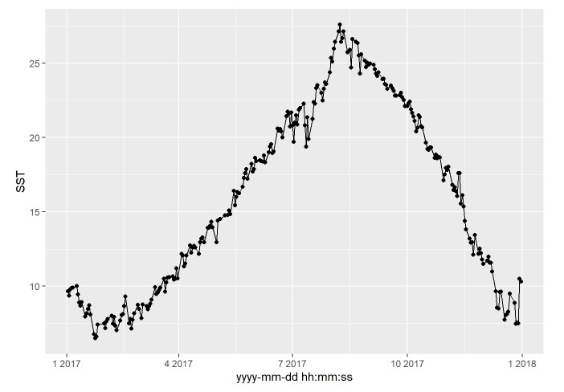
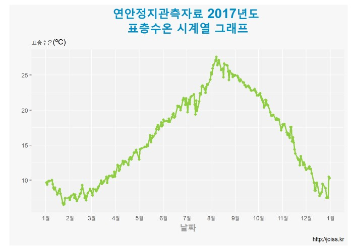

------------------------------------------------------------------------

이번 튜토리얼에서는 데이터프레임의 형태로 저장된 데이터로 표층수온
시계열 그래프를 그려보고자 한다.

본 튜토리얼에서는 예제파일로 [JOISS](http://joiss.kr) 에서 제공하고 있는
국립수산과학원의 2018년도 연안정지관측자료 파일을 사용하였다.

튜토리얼 순서는 아래와 같다.

\[목차\]  
1.csv 불러오기

2.데이터셋 전처리하기

3.시계열 그래프 그리기

------------------------------------------------------------------------

### csv파일 불러오기

csv파일의 데이터를 데이터프레임 형태로 변환하기 위해 `dataset`이라는
변수에 csv파일 경로와 이름을 저장한다.

``` r
dataset <- "C:/Users/User/Documents/R/연안정지관측자료_2017_profile_meteorological_unknown.csv" 
```

### 데이터셋 전처리하기

불러온 csv 파일을 데이터프레임 형태로 변환하기 전에, JOISS에서 제공하고
있는 데이터의 경우 데이터셋 상단에 메타정보를 함께 제공하고 있기 때문에
데이터프레임 형태로 변환하기 위해서는 메타정보를 삭제하는 전처리를
진행해야 한다. 아래 코드는 ‘/’ 기호가 포함된 메타정보 줄을 삭제하고
컬럼명을 다시 매칭시키는 작업이다. 이 때, ’/’기호 포함여부에 따라
삭제되는 행의 갯수가 조금씩 달라질 수 있으므로 행의 갯수를 확인하여야
한다.

``` r
removed_row <- length(grep("/.*", readLines(dataset)))
coastal <- read.csv(dataset, skip = removed_row, header = F, stringsAsFactors=FALSE)
coastal_colnames <- read.csv(dataset, skip = (removed_row-1), header = F, nrows = 1, as.is = T)
colnames(coastal)  <-  coastal_colnames[1, 1:ncol(coastal)]
coastal <- coastal[, grepl("_flag", colnames(coastal)) == F]
```

``` r
coastal
```

csv 파일을 데이터 프레임 형태로 변환이 완료되었으면 각 컬럼의 문자형식을
확인하여야 한다. 이때, 날짜 형식이 문자(chr)형태로 지정되어 있다면
[`as.POSIXct`](https://www.rdocumentation.org/packages/dwtools/versions/0.8.3.9/topics/as.POSIXct)
함수를 사용하여 날짜 형식으로 변환시킨다.

``` r
coastal$`yyyy-mm-dd hh:mm:ss` <- as.POSIXct(coastal$`yyyy-mm-dd hh:mm:ss`, format="%Y-%m-%d")
```

### 시계열 그래프 그리기

이제, 표층수온 시계열 그래프를 그려보자. 시계열 그래프를 그리기 위해서는
[`ggplot2`](https://www.rdocumentation.org/packages/ggplot2/versions/3.3.0)
함수의 패키지를 설치하고 선언해야 한다. 본 튜토리얼에서는 월평균
표층수온 시계열 그래프를 그리기 때문에 월평균 표층수온값을 구해야 한다.
이 때 `ggplot` 함수에서 `subset` 기능을 사용하면 데이터마다 새로운
데이터 셋을 생성해야 하는 번거로움을 줄일 수 있다. 평균값 계산시
[`dplyr`](https://www.rdocumentation.org/packages/dbplyr/versions/1.4.2)패키지의
설치와 선언을 하고,
[`group_by`](https://www.rdocumentation.org/packages/dplyr/versions/0.7.8/topics/group_by)
를 사용하여 계산조건을 지정한다. 라인 그래프를 그릴때에는 데이터에
null값을 제외시키지 않으면 시계열 그래프가 끊기게 표현될 수 있기 때문에
subset 에서 null값도 제외시켜준다.

``` r
install.packages("dplyr")
```

``` r
library(dplyr)
library(ggplot2)
ggplot(subset(coastal %>% 
                group_by(`yyyy-mm-dd hh:mm:ss`) %>% 
                dplyr::summarize(SST = mean(`수온[℃]`, na.rm=TRUE)),
              SST != "NaN"), 
       aes(`yyyy-mm-dd hh:mm:ss`, SST)) +
  geom_line() +
  geom_point()
```



이번엔 그래프 제목, x축, y축, 기울기선 등 설정을 추가해보자. 이 때, 축의
틱 레이블 설정 함수를 사용하기 위해서는
[`scales`](https://www.rdocumentation.org/packages/scales/versions/0.4.1)
패키지의 설치와 선언을 해야한다. 제목, 범례등의 색을 변경하고 싶을
때에는
[`theme`](https://www.rdocumentation.org/packages/ggplot2/versions/2.0.0/topics/theme)
함수를 사용하며 색 지정시에는 R color cheatsheet를 참고하거나, html컬러
코드를 사용한다.

``` r
install.packages("scales")
```

``` r
library(scales)
ggplot(subset(coastal %>% 
                group_by(`yyyy-mm-dd hh:mm:ss`) %>% 
                dplyr::summarize(SST = mean(`수온[℃]`, na.rm=TRUE)),
              SST != "NaN"),
       aes(`yyyy-mm-dd hh:mm:ss`, SST)) +
  # 그래프 제목, 부제목, 축제목, 캡션 설정 (\n=줄바꿈)
  labs(title="연안정지관측자료 2017년도 \n표층수온 시계열 그래프", 
       subtitle="표층수온(ºC)", x="날짜", y="", caption="http://joiss.kr") +
  # 색, 사이즈 설정
  geom_line(color="#8fcd42", size=1) +
  geom_point(size=1.5, color="#8fcd42") +
  # y축 틱 레이블 설정
  scale_y_continuous(breaks = seq(0, 30, by = 5))+
  # x축 틱 레이블 설정(날짜형식이 POSIXct 로 지정되어 있을경우 사용)
  scale_x_datetime(breaks = date_breaks("1 month"), minor_breaks=date_breaks("1 month"), 
                   # 표출할 날짜 형식 및 timezone 지정
                   labels=date_format("%B", tz="Asia/Seoul"), 
                   # limits를 사용하여 표츨할 날짜 범위 지정
                   limits = as.POSIXct(c("2017-01-01 00:00:00", "2017-12-31 11:59:59")))+
  theme(
        # 범례 표출 여부 및 위치 지정
        legend.position = "none", 
        # 제목 및 축제목 크기 및 표출여부 설정
        plot.title = element_text(hjust = 0.5, size=20, face='bold', color="#018dc5"),
        axis.title.x = element_text(size=15,color='#999999',face='bold' ),
        axis.text.y = element_text(color='gray40'),
        #눈금선 설정
        axis.ticks.x=element_blank(),
        # plot 배경색 지정
        plot.background = element_rect(fill = "gray97"),
        # 그래프 배경색 설정
        panel.background = element_rect(fill = "gray95")
  )
```



시계열 그래프를 확인해보면 연안정지관측자료의 2017년도 수온은 8월에 가장
높게 나타나고 1월 말에 가장 낮게 나타나는것을 알 수 있다.

이상으로 R을 이용한 표층수온 시계열그래프 그리기 튜토리얼을 마치도록
하겠다.
