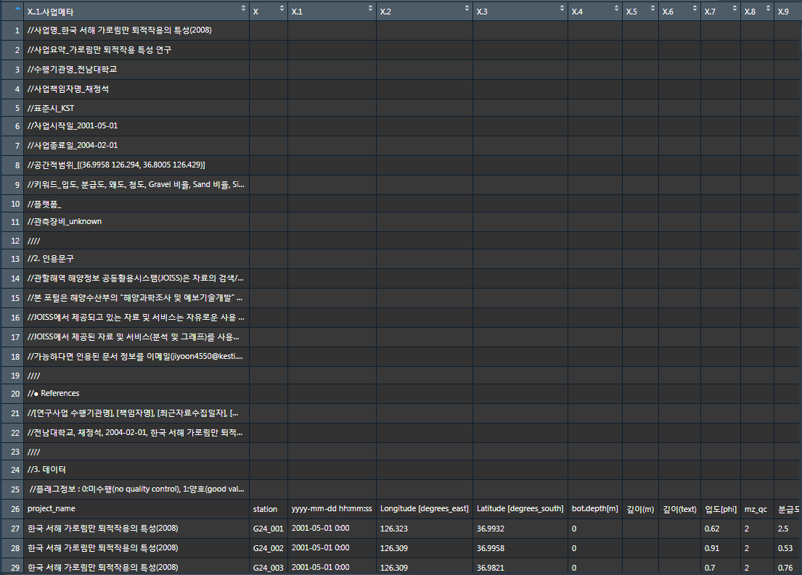
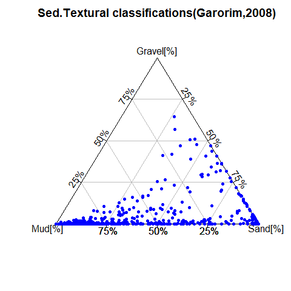
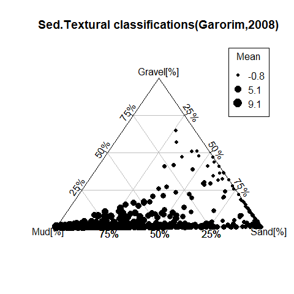
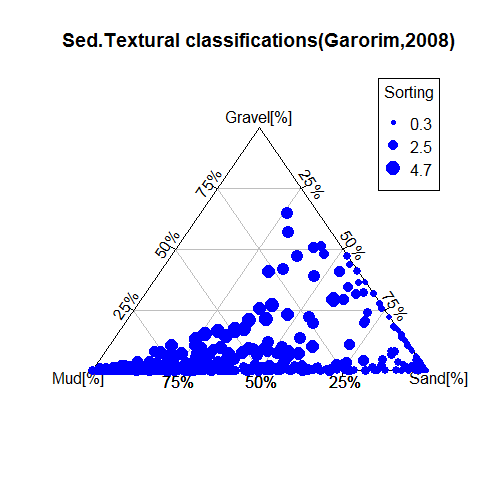
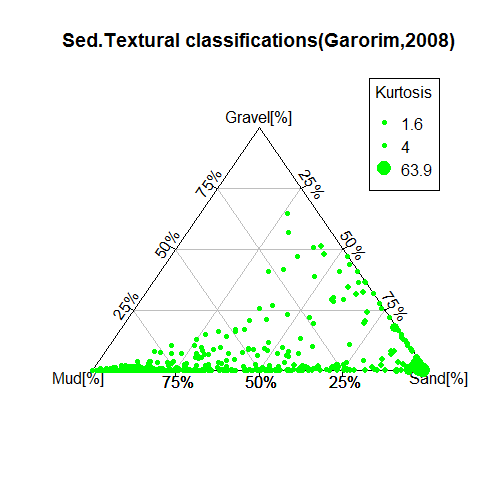

***

이번 튜토리얼에서는 해양저질 퇴적물의 입도조성 자료를 R에서 제공하는 “rysgran” package를 이용해 시각화하는 방법을 설명하고자 한다.   
본 튜토리얼에서는 예제파일로 [JOISS](https://joiss.kr)에서 제공하고 있는 표층퇴적물 입도조성 자료를 사용하였다. 튜토리얼 순서는 아래와 같다.   
<br>
__[목차]__  
__1. R Package “rysgran” 소개 및 설치__  
__2. R Studio에서 JOISS 퇴적물 입도 자료 불러오기__  
__3. 삼각 다이어그램 (Ternary Diagram) 그리기__  

***

# . R Package “rysgran” 소개 및 설치  
  
## . R Package “rysgran” 소개
  
[`rysgran`](https://www.rdocumentation.org/packages/rysgran/versions/2.1.0)는 2006년에 Camargo가 델파이(Delphi)로 작성한 SysGran 소프트웨어의 R 부분이다.  
표층 퇴적물 입도 분석 자료를 Folk & Ward (1957) 및 Methods of Moments (Tanner, 1995)와 같은 다양한 방법을 기반으로 계산한다. 분류되지 않은 퇴적물의 유형 분류는 Shepard (1954)와 Pejrup (1988) 등의 방법을 사용해서 삼각다이어그램(Ternary Diagram)으로 나타낼 수 있다.  
    
## . R Package “rysgran” 설치
  
[`rysgran`](https://www.rdocumentation.org/packages/rysgran/versions/2.1.0)패키지를 설치하고 선언하였다.


```r
# Download and install a package from CRAN
install.packages("rysgran")
```

```r
# Load the package into the session making all its functoins available to use
library(rysgran)
```

***

# . R Studio에서 JOISS 퇴적물 입도 자료 불러오기

## . R과 R Studio 프로그램이 설치
  
R과 R Studio 프로그램이 설치되어있지 않은 사용자는 JOISS포털의 [R튜토리얼-R다운로드 및 설치](http://joiss.kr/joiss/cont.tuto.rTutoList.do)를 참고하길 바란다.

## . JOISS 표층 퇴적물 입도 자료 불러오기
  
본 튜토리얼에서는 예제파일로 JOISS에서 제공하는 표층퇴적물 입도 분석자료를 이용하였다. 해당 자료는 2008년 가로림만에서 수행된 표층 퇴적물 입도 분석자료로 csv로 작성되었으며 자료에 대한 메타데이터 및 QCflag 등이 포함되어 있다.
<br>    
     
__그림 1. JOISS에서 제공하는 예제파일 구조__  
    
<br> 
R Studio에서 예제 파일을 불러오기 위해 `setwd`함수로 예제 파일이 저장된 경로로 설정하였다.


`read.table` 함수로 메타데이터가 포함된 내용은 제거 한 후 변수 "data"에 저장하고, `colnames` 함수로 변수내 항목을 확인하면 해당 예제파일에는 26개의 항목들이 들어있는것을 확인할 수 있다.  


```r
#Change the current working directory
setwd("G:/R/Rmarkdown/01.rysgran_sediment/00.data")
#Load the data into a table using the read.table function
data <- read.table("한국 서해 가로림만 퇴적작용의 특성_2008_profile_geological_unknown.csv", skip = 26, header = TRUE, sep = ",")
#Make sure the variable name of the table
colnames(data)
```

```
##  [1] "project_name"             "station"                 
##  [3] "yyyy.mm.dd.hh.mm.ss"      "Longitude..degrees_east."
##  [5] "Latitude..degrees_south." "bot.depth.m."            
##  [7] "깊이.m."                  "깊이.text."              
##  [9] "입도.phi."                "mz_qc"                   
## [11] "분급도.무단위."           "sd_qc"                   
## [13] "왜도.무단위."             "sk_qc"                   
## [15] "첨도.무단위."             "k_qc"                    
## [17] "Gravel.비율..."           "graper_qc"               
## [19] "Sand.비율..."             "sandper_qc"              
## [21] "Silt.비율..."             "siltper_qc"              
## [23] "Clay.비율..."             "clayper_qc"              
## [25] "퇴적물유형.무단위."       "sedtype_qc"
```

변수 “data”에 저장된 26개의 항목들 중 시각화에 필요한 항목들만 `data.frame` 함수를 사용하여 “data01” 데이터프레임을 생성하고 해당 항목들의 이름을  `colnames` 함수를 이용해 새롭게 매칭하였다.  


퇴적물 조성비를 "Gravel[%]", "Sand[%]", "Mud[%]"로 가시화 하기 위해 "Silt.비율..."과 "Clay.비율..."의 합을 "Mud[%]"로 나타냈다. `colnames`, `View` 함수를 사용하면 새롭게 매칭된 항목을 포함한 "data01"변수 및 데이터를 확인할 수 있다.  
  


```r
#Create data frame and match the variable name
data01 <- data.frame(data$station, data$yyyy.mm.dd.hh.mm.ss, 
          data$Longitude..degrees_east., data$Latitude..degrees_south, 
          data$Gravel.비율..., data$Sand.비율..., data$Silt.비율..., data$Clay.비율..., 
          data$Silt.비율...+data$Clay.비율..., 
          data$입도.phi., data$분급도.무단위., data$왜도.무단위., data$첨도.무단위.)
colnames(data01)=c("Station", "Time", 
                   "Longitute", "Latitude", 
                   "Gravel[%]", "Sand[%]", "Silt[%]", "Clay[%]", 
                   "Mud[%]",
                   "Mean", "Sorting", "Skewness", "Kurtosis")
colnames(data01)
```

```
##  [1] "Station"   "Time"      "Longitute" "Latitude"  "Gravel[%]" "Sand[%]"  
##  [7] "Silt[%]"   "Clay[%]"   "Mud[%]"    "Mean"      "Sorting"   "Skewness" 
## [13] "Kurtosis"
```

<div style="border: 1px solid #ddd; padding: 0px; overflow-y: scroll; height:500px; "><table class="table table-striped" style="font-size: 12px; margin-left: auto; margin-right: auto;">
<caption style="font-size: initial !important;">표 1. data.frame 함수를 사용하여 새롭게 정의된 데이터테이블(상위20개)</caption>
 <thead>
  <tr>
   <th style="text-align:left;position: sticky; top:0; background-color: #FFFFFF;">   </th>
   <th style="text-align:center;position: sticky; top:0; background-color: #FFFFFF;"> Station </th>
   <th style="text-align:center;position: sticky; top:0; background-color: #FFFFFF;"> Time </th>
   <th style="text-align:center;position: sticky; top:0; background-color: #FFFFFF;"> Longitute </th>
   <th style="text-align:center;position: sticky; top:0; background-color: #FFFFFF;"> Latitude </th>
   <th style="text-align:center;position: sticky; top:0; background-color: #FFFFFF;"> Gravel[%] </th>
   <th style="text-align:center;position: sticky; top:0; background-color: #FFFFFF;"> Sand[%] </th>
   <th style="text-align:center;position: sticky; top:0; background-color: #FFFFFF;"> Silt[%] </th>
   <th style="text-align:center;position: sticky; top:0; background-color: #FFFFFF;"> Clay[%] </th>
   <th style="text-align:center;position: sticky; top:0; background-color: #FFFFFF;"> Mud[%] </th>
   <th style="text-align:center;position: sticky; top:0; background-color: #FFFFFF;"> Mean </th>
   <th style="text-align:center;position: sticky; top:0; background-color: #FFFFFF;"> Sorting </th>
   <th style="text-align:center;position: sticky; top:0; background-color: #FFFFFF;"> Skewness </th>
   <th style="text-align:center;position: sticky; top:0; background-color: #FFFFFF;"> Kurtosis </th>
  </tr>
 </thead>
<tbody>
  <tr>
   <td style="text-align:left;"> 1 </td>
   <td style="text-align:center;"> G24_001 </td>
   <td style="text-align:center;"> 2001-05-01 0:00 </td>
   <td style="text-align:center;"> 126.32 </td>
   <td style="text-align:center;"> 36.99 </td>
   <td style="text-align:center;"> 31.30 </td>
   <td style="text-align:center;"> 63.45 </td>
   <td style="text-align:center;"> 2.99 </td>
   <td style="text-align:center;"> 2.26 </td>
   <td style="text-align:center;"> 5.25 </td>
   <td style="text-align:center;"> 0.62 </td>
   <td style="text-align:center;"> 2.50 </td>
   <td style="text-align:center;"> 1.43 </td>
   <td style="text-align:center;"> 7.68 </td>
  </tr>
  <tr>
   <td style="text-align:left;"> 2 </td>
   <td style="text-align:center;"> G24_002 </td>
   <td style="text-align:center;"> 2001-05-01 0:00 </td>
   <td style="text-align:center;"> 126.31 </td>
   <td style="text-align:center;"> 37.00 </td>
   <td style="text-align:center;"> 0.55 </td>
   <td style="text-align:center;"> 99.23 </td>
   <td style="text-align:center;"> 0.22 </td>
   <td style="text-align:center;"> 0.00 </td>
   <td style="text-align:center;"> 0.22 </td>
   <td style="text-align:center;"> 0.91 </td>
   <td style="text-align:center;"> 0.53 </td>
   <td style="text-align:center;"> -0.32 </td>
   <td style="text-align:center;"> 8.10 </td>
  </tr>
  <tr>
   <td style="text-align:left;"> 3 </td>
   <td style="text-align:center;"> G24_003 </td>
   <td style="text-align:center;"> 2001-05-01 0:00 </td>
   <td style="text-align:center;"> 126.31 </td>
   <td style="text-align:center;"> 36.98 </td>
   <td style="text-align:center;"> 4.29 </td>
   <td style="text-align:center;"> 95.52 </td>
   <td style="text-align:center;"> 0.19 </td>
   <td style="text-align:center;"> 0.00 </td>
   <td style="text-align:center;"> 0.19 </td>
   <td style="text-align:center;"> 0.70 </td>
   <td style="text-align:center;"> 0.76 </td>
   <td style="text-align:center;"> -0.97 </td>
   <td style="text-align:center;"> 5.44 </td>
  </tr>
  <tr>
   <td style="text-align:left;"> 4 </td>
   <td style="text-align:center;"> G24_004 </td>
   <td style="text-align:center;"> 2001-05-01 0:00 </td>
   <td style="text-align:center;"> 126.32 </td>
   <td style="text-align:center;"> 36.98 </td>
   <td style="text-align:center;"> 36.17 </td>
   <td style="text-align:center;"> 63.70 </td>
   <td style="text-align:center;"> 0.13 </td>
   <td style="text-align:center;"> 0.00 </td>
   <td style="text-align:center;"> 0.13 </td>
   <td style="text-align:center;"> -0.03 </td>
   <td style="text-align:center;"> 1.10 </td>
   <td style="text-align:center;"> 0.01 </td>
   <td style="text-align:center;"> 1.89 </td>
  </tr>
  <tr>
   <td style="text-align:left;"> 5 </td>
   <td style="text-align:center;"> G24_005 </td>
   <td style="text-align:center;"> 2001-05-01 0:00 </td>
   <td style="text-align:center;"> 126.33 </td>
   <td style="text-align:center;"> 36.98 </td>
   <td style="text-align:center;"> 0.74 </td>
   <td style="text-align:center;"> 99.11 </td>
   <td style="text-align:center;"> 0.15 </td>
   <td style="text-align:center;"> 0.00 </td>
   <td style="text-align:center;"> 0.15 </td>
   <td style="text-align:center;"> 0.94 </td>
   <td style="text-align:center;"> 0.48 </td>
   <td style="text-align:center;"> -0.65 </td>
   <td style="text-align:center;"> 10.55 </td>
  </tr>
  <tr>
   <td style="text-align:left;"> 6 </td>
   <td style="text-align:center;"> G24_006 </td>
   <td style="text-align:center;"> 2001-05-01 0:00 </td>
   <td style="text-align:center;"> 126.33 </td>
   <td style="text-align:center;"> 36.98 </td>
   <td style="text-align:center;"> 0.55 </td>
   <td style="text-align:center;"> 84.82 </td>
   <td style="text-align:center;"> 8.72 </td>
   <td style="text-align:center;"> 6.41 </td>
   <td style="text-align:center;"> 15.13 </td>
   <td style="text-align:center;"> 2.78 </td>
   <td style="text-align:center;"> 2.43 </td>
   <td style="text-align:center;"> 2.48 </td>
   <td style="text-align:center;"> 8.63 </td>
  </tr>
  <tr>
   <td style="text-align:left;"> 7 </td>
   <td style="text-align:center;"> G24_007 </td>
   <td style="text-align:center;"> 2001-05-01 0:00 </td>
   <td style="text-align:center;"> 126.34 </td>
   <td style="text-align:center;"> 36.98 </td>
   <td style="text-align:center;"> 0.00 </td>
   <td style="text-align:center;"> 98.73 </td>
   <td style="text-align:center;"> 1.27 </td>
   <td style="text-align:center;"> 0.00 </td>
   <td style="text-align:center;"> 1.27 </td>
   <td style="text-align:center;"> 2.22 </td>
   <td style="text-align:center;"> 0.71 </td>
   <td style="text-align:center;"> -0.35 </td>
   <td style="text-align:center;"> 3.46 </td>
  </tr>
  <tr>
   <td style="text-align:left;"> 8 </td>
   <td style="text-align:center;"> G24_008 </td>
   <td style="text-align:center;"> 2001-05-01 0:00 </td>
   <td style="text-align:center;"> 126.34 </td>
   <td style="text-align:center;"> 36.97 </td>
   <td style="text-align:center;"> 0.12 </td>
   <td style="text-align:center;"> 35.75 </td>
   <td style="text-align:center;"> 42.78 </td>
   <td style="text-align:center;"> 21.35 </td>
   <td style="text-align:center;"> 64.13 </td>
   <td style="text-align:center;"> 5.56 </td>
   <td style="text-align:center;"> 3.17 </td>
   <td style="text-align:center;"> 0.64 </td>
   <td style="text-align:center;"> 2.49 </td>
  </tr>
  <tr>
   <td style="text-align:left;"> 9 </td>
   <td style="text-align:center;"> G24_009 </td>
   <td style="text-align:center;"> 2001-05-01 0:00 </td>
   <td style="text-align:center;"> 126.34 </td>
   <td style="text-align:center;"> 36.97 </td>
   <td style="text-align:center;"> 0.00 </td>
   <td style="text-align:center;"> 98.03 </td>
   <td style="text-align:center;"> 1.97 </td>
   <td style="text-align:center;"> 0.00 </td>
   <td style="text-align:center;"> 1.97 </td>
   <td style="text-align:center;"> 1.97 </td>
   <td style="text-align:center;"> 0.65 </td>
   <td style="text-align:center;"> 0.66 </td>
   <td style="text-align:center;"> 5.23 </td>
  </tr>
  <tr>
   <td style="text-align:left;"> 10 </td>
   <td style="text-align:center;"> G24_010 </td>
   <td style="text-align:center;"> 2001-05-01 0:00 </td>
   <td style="text-align:center;"> 126.35 </td>
   <td style="text-align:center;"> 36.97 </td>
   <td style="text-align:center;"> 0.00 </td>
   <td style="text-align:center;"> 9.28 </td>
   <td style="text-align:center;"> 0.72 </td>
   <td style="text-align:center;"> 0.00 </td>
   <td style="text-align:center;"> 0.72 </td>
   <td style="text-align:center;"> 1.60 </td>
   <td style="text-align:center;"> 0.56 </td>
   <td style="text-align:center;"> 0.89 </td>
   <td style="text-align:center;"> 6.47 </td>
  </tr>
  <tr>
   <td style="text-align:left;"> 11 </td>
   <td style="text-align:center;"> G24_011 </td>
   <td style="text-align:center;"> 2001-05-01 0:00 </td>
   <td style="text-align:center;"> 126.35 </td>
   <td style="text-align:center;"> 36.97 </td>
   <td style="text-align:center;"> 0.18 </td>
   <td style="text-align:center;"> 49.79 </td>
   <td style="text-align:center;"> 30.92 </td>
   <td style="text-align:center;"> 19.11 </td>
   <td style="text-align:center;"> 50.03 </td>
   <td style="text-align:center;"> 5.10 </td>
   <td style="text-align:center;"> 3.13 </td>
   <td style="text-align:center;"> 0.95 </td>
   <td style="text-align:center;"> 2.90 </td>
  </tr>
  <tr>
   <td style="text-align:left;"> 12 </td>
   <td style="text-align:center;"> G24_012 </td>
   <td style="text-align:center;"> 2001-05-01 0:00 </td>
   <td style="text-align:center;"> 126.36 </td>
   <td style="text-align:center;"> 36.97 </td>
   <td style="text-align:center;"> 0.00 </td>
   <td style="text-align:center;"> 35.22 </td>
   <td style="text-align:center;"> 46.47 </td>
   <td style="text-align:center;"> 18.31 </td>
   <td style="text-align:center;"> 64.78 </td>
   <td style="text-align:center;"> 5.48 </td>
   <td style="text-align:center;"> 2.82 </td>
   <td style="text-align:center;"> 0.94 </td>
   <td style="text-align:center;"> 2.96 </td>
  </tr>
  <tr>
   <td style="text-align:left;"> 13 </td>
   <td style="text-align:center;"> G24_013 </td>
   <td style="text-align:center;"> 2001-05-01 0:00 </td>
   <td style="text-align:center;"> 126.36 </td>
   <td style="text-align:center;"> 36.97 </td>
   <td style="text-align:center;"> 0.03 </td>
   <td style="text-align:center;"> 41.78 </td>
   <td style="text-align:center;"> 41.49 </td>
   <td style="text-align:center;"> 16.70 </td>
   <td style="text-align:center;"> 58.19 </td>
   <td style="text-align:center;"> 5.29 </td>
   <td style="text-align:center;"> 2.79 </td>
   <td style="text-align:center;"> 1.22 </td>
   <td style="text-align:center;"> 3.44 </td>
  </tr>
  <tr>
   <td style="text-align:left;"> 14 </td>
   <td style="text-align:center;"> G24_014 </td>
   <td style="text-align:center;"> 2001-05-01 0:00 </td>
   <td style="text-align:center;"> 126.37 </td>
   <td style="text-align:center;"> 36.97 </td>
   <td style="text-align:center;"> 0.54 </td>
   <td style="text-align:center;"> 49.32 </td>
   <td style="text-align:center;"> 41.25 </td>
   <td style="text-align:center;"> 8.89 </td>
   <td style="text-align:center;"> 50.14 </td>
   <td style="text-align:center;"> 4.56 </td>
   <td style="text-align:center;"> 2.37 </td>
   <td style="text-align:center;"> 1.24 </td>
   <td style="text-align:center;"> 5.57 </td>
  </tr>
  <tr>
   <td style="text-align:left;"> 15 </td>
   <td style="text-align:center;"> G24_015 </td>
   <td style="text-align:center;"> 2001-05-01 0:00 </td>
   <td style="text-align:center;"> 126.38 </td>
   <td style="text-align:center;"> 36.98 </td>
   <td style="text-align:center;"> 0.00 </td>
   <td style="text-align:center;"> 12.91 </td>
   <td style="text-align:center;"> 75.79 </td>
   <td style="text-align:center;"> 11.30 </td>
   <td style="text-align:center;"> 87.09 </td>
   <td style="text-align:center;"> 5.44 </td>
   <td style="text-align:center;"> 1.84 </td>
   <td style="text-align:center;"> 1.38 </td>
   <td style="text-align:center;"> 6.35 </td>
  </tr>
  <tr>
   <td style="text-align:left;"> 16 </td>
   <td style="text-align:center;"> G24_016 </td>
   <td style="text-align:center;"> 2001-05-01 0:00 </td>
   <td style="text-align:center;"> 126.37 </td>
   <td style="text-align:center;"> 36.97 </td>
   <td style="text-align:center;"> 0.16 </td>
   <td style="text-align:center;"> 33.59 </td>
   <td style="text-align:center;"> 53.08 </td>
   <td style="text-align:center;"> 13.17 </td>
   <td style="text-align:center;"> 66.25 </td>
   <td style="text-align:center;"> 5.25 </td>
   <td style="text-align:center;"> 2.50 </td>
   <td style="text-align:center;"> 1.44 </td>
   <td style="text-align:center;"> 4.62 </td>
  </tr>
  <tr>
   <td style="text-align:left;"> 17 </td>
   <td style="text-align:center;"> G24_017 </td>
   <td style="text-align:center;"> 2001-05-01 0:00 </td>
   <td style="text-align:center;"> 126.37 </td>
   <td style="text-align:center;"> 36.97 </td>
   <td style="text-align:center;"> 0.00 </td>
   <td style="text-align:center;"> 46.25 </td>
   <td style="text-align:center;"> 38.11 </td>
   <td style="text-align:center;"> 15.64 </td>
   <td style="text-align:center;"> 53.75 </td>
   <td style="text-align:center;"> 5.14 </td>
   <td style="text-align:center;"> 2.65 </td>
   <td style="text-align:center;"> 1.37 </td>
   <td style="text-align:center;"> 3.78 </td>
  </tr>
  <tr>
   <td style="text-align:left;"> 18 </td>
   <td style="text-align:center;"> G24_018 </td>
   <td style="text-align:center;"> 2001-05-01 0:00 </td>
   <td style="text-align:center;"> 126.37 </td>
   <td style="text-align:center;"> 36.97 </td>
   <td style="text-align:center;"> 0.00 </td>
   <td style="text-align:center;"> 76.31 </td>
   <td style="text-align:center;"> 16.79 </td>
   <td style="text-align:center;"> 6.90 </td>
   <td style="text-align:center;"> 23.69 </td>
   <td style="text-align:center;"> 3.80 </td>
   <td style="text-align:center;"> 2.08 </td>
   <td style="text-align:center;"> 2.38 </td>
   <td style="text-align:center;"> 8.29 </td>
  </tr>
  <tr>
   <td style="text-align:left;"> 19 </td>
   <td style="text-align:center;"> G24_019 </td>
   <td style="text-align:center;"> 2001-05-01 0:00 </td>
   <td style="text-align:center;"> 126.36 </td>
   <td style="text-align:center;"> 36.97 </td>
   <td style="text-align:center;"> 0.15 </td>
   <td style="text-align:center;"> 99.85 </td>
   <td style="text-align:center;"> 0.00 </td>
   <td style="text-align:center;"> 0.00 </td>
   <td style="text-align:center;"> 0.00 </td>
   <td style="text-align:center;"> 1.76 </td>
   <td style="text-align:center;"> 0.66 </td>
   <td style="text-align:center;"> -0.42 </td>
   <td style="text-align:center;"> 5.09 </td>
  </tr>
  <tr>
   <td style="text-align:left;"> 20 </td>
   <td style="text-align:center;"> G24_020 </td>
   <td style="text-align:center;"> 2001-05-01 0:00 </td>
   <td style="text-align:center;"> 126.35 </td>
   <td style="text-align:center;"> 36.97 </td>
   <td style="text-align:center;"> 5.31 </td>
   <td style="text-align:center;"> 94.69 </td>
   <td style="text-align:center;"> 0.00 </td>
   <td style="text-align:center;"> 0.00 </td>
   <td style="text-align:center;"> 0.00 </td>
   <td style="text-align:center;"> 0.57 </td>
   <td style="text-align:center;"> 0.98 </td>
   <td style="text-align:center;"> -0.03 </td>
   <td style="text-align:center;"> 3.83 </td>
  </tr>
</tbody>
</table></div>
   
   
***

# . 삼각 다이어그램 (Ternary Diagram) 그리기  
  
## . 퇴적물 조성비 나타내기
  
퇴적물 조성비를 [rysgran.ternary](https://www.rdocumentation.org/packages/rysgran/versions/2.1.0/topics/rysgran.ternary) 함수로 삼각다이어그램으로 시각화하였다. [rysgran.ternary](https://www.rdocumentation.org/packages/rysgran/versions/2.1.0/topics/rysgran.ternary) 함수의 'method'의 옵션은 `shepard`, `pejrup`, `flemming`이 있으며 본 예제에서는 `shepard`를 사용하였다.


```r
#Plotting of Mud, Sand and Gravel texture(shepard, pejrup, flemming)

rysgran.ternary(x = data01[c(9, 6, 5)], method = "shepard",
                main = "Sed.Textural classifications(Garorim,2008)",
                col = "blue", pch = 20,
                show.grid = TRUE, show.legend = FALSE, 
                show.lines = FALSE, show.names = FALSE)
```

"__그림 2. 퇴적물 조성비 삼각다이어그램__"    

## . 퇴적물 조성비와 평균입도, 분급도, 왜도, 첨도 data 함께 나타내기
  
퇴적물 조성비와 평균입도, 분급도, 왜도, 첨도 data를 함께 나타낼 경우는 polygon의 크기와 범례로 수치를 가시화 할수 있다.  


```r
#Plotting of Mud, Sand and Gravel texture and Add Mean[Phi] data
rysgran.ternary(x = data01[c(9, 6, 5)], method = "shepard",
                main = "Sed.Textural classifications(Garorim,2008)",
                z = data01$Mean, z.cex.range = c(1,3),
                z.cex.labels = 22, z.cex.names = "Mean",
                col = "black", pch = 20,
                show.grid = TRUE, show.legend = FALSE, 
                show.lines = FALSE, show.names = FALSE)
legend.bubbles ("topright", z=data01$Mean, nleg=3, pch=20, col="black",
                cex=1, z.cex.range=c(1,3), x.intersp=1.2, y.intersp=1.2, 
                digits=1, title="Mean")

#Plotting of Mud, Sand and Gravel texture and Add Sorting data
rysgran.ternary(x = data01[c(9, 6, 5)], method = "shepard",
                main = "Sed.Textural classifications(Garorim,2008)",
                z = data01$Sorting, z.cex.range = c(1,3),
                z.cex.labels = 22, z.cex.names = "Sorting",
                col = "blue", pch = 20,
                show.grid = TRUE, show.legend = FALSE, 
                show.lines = FALSE, show.names = FALSE)
legend.bubbles ("topright", z=data01$Sorting , nleg=3, pch=20, col="blue",
                cex=1, z.cex.range=c(1,3), x.intersp=1.2, y.intersp=1.2, 
                digits=1, title="Sorting")

#Plotting of Mud, Sand and Gravel texture and Add Skewness data
rysgran.ternary(x = data01[c(9, 6, 5)], method = "shepard",
                main = "Sed.Textural classifications(Garorim,2008)",
                z = data01$Skewness, z.cex.range = c(1,3),
                z.cex.labels = 22, z.cex.names = "Skewness",
                col = "red", pch = 20,
                show.grid = TRUE, show.legend = FALSE, 
                show.lines = FALSE, show.names = FALSE)
legend.bubbles ("topright", z=data01$Skewness , nleg=3, pch=20, col="red",
                cex=1, z.cex.range=c(1,3), x.intersp=1.2, y.intersp=1.2, 
                digits=1, title="Skewness")

#Plotting of Mud, Sand and Gravel texture and Add Kurtosis data
rysgran.ternary(x = data01[c(9, 6, 5)], method = "shepard",
                main = "Sed.Textural classifications(Garorim,2008)",
                z = data01$Kurtosis, z.cex.range = c(1,3),
                z.cex.labels = 22, z.cex.names = "Kurtosis",
                col = "green", pch = 20,
                show.grid = TRUE, show.legend = FALSE, 
                show.lines = FALSE, show.names = FALSE)
legend.bubbles ("topright", z=data01$Kurtosis , nleg=3, pch=20, col="green",
                cex=1, z.cex.range=c(1,3), x.intersp=1.2, y.intersp=1.2, 
                digits=1, title="Kurtosis")
```    
__그림 3. 평균입도, 분급도, 왜도, 첨도 data가 포함된 퇴적물 조성비 삼각다이어그램__

__그림 3. 평균입도, 분급도, 왜도, 첨도 data가 포함된 퇴적물 조성비 삼각다이어그램__


__     __그림 3. 평균입도, 분급도, 왜도, 첨도 data가 포함된 퇴적물 조성비 삼각다이어그램__   

<br> 
Gravel이 포함된 퇴적물에서의 분급도가 Snad나 Mud로만 이루어진 퇴적물보다 분급도가 크게 나타남을 알 수 있다.    

<br> 
다음 튜토리얼에서는 다른 방법으로 해양저질 퇴적물의 입도조성 자료를 시각화하는 방법을 소개하겠다.
