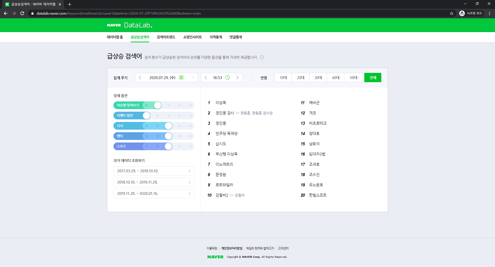
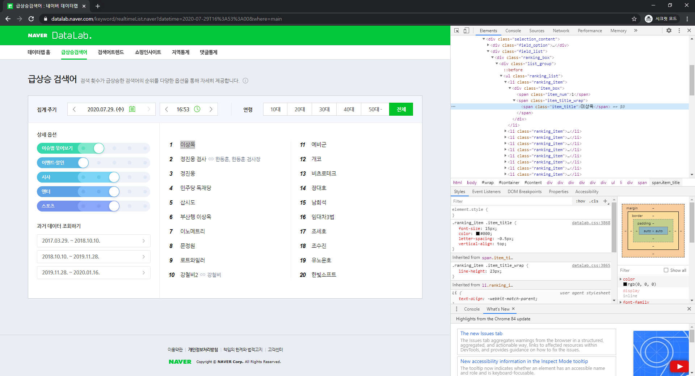
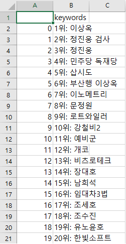

# Selenium과 BeautifulSoup를 활용한 Python 크롤링

## 1. Selenium이란

셀레니움(selenium)은 웹 사이트 테스트를 위한 도구로 브라우저 동작을 자동화할 수 있습니다.

프로그래밍으로 브라우저 동작을 제어하여 프로그램을 통한 접근을 허용하지 않는 경우, 동적 웹 페이지로 구성되어 있는 경우에도 웹 페이지를 요청하고 응답받아올 수 있습니다.

셀레니움 설치 방법 :  `pip3 install selenium`

크롬 웹 드라이버가 필요합니다. 본인이 사용하는 크롬 브라우저의 버전에 맞는 드라이버를 설치하면 됩니다. 크롬 웹 드라이버를 다운 받을 수 있는 주소입니다. 

[`chrome_webdirver 다운로드 주소`](https://chromedriver.chromium.org/downloads)


## 2. BeautifulSoup이란

Beautifulsoup는 html/xml parser로써 원하는 태그정보를 쉽게 추출할 수 있습니다.

Beautifulsoup 설치 방법 `pip3 install Beautifulsoup4`


## 3. 사용

설치한 selenium과 beautifulsoup 그리고 결과를 csv 파일로 저장하기 위한 pandas 라이브러리를 import 합니다.

```python
from selenium import webdriver
from bs4 import BeautifulSoup
import pandas as pd
```


그 다음 driver 변수에 크롬 웹 드라이버가 설치되어 있는 경로를 지정하여 webrdiver 객체를 생성합니다.

```python
chromedriver = '크롬 웹 드라이버가 설치되어 있는 경로'
options = webdriver.ChromeOptions()
options.add_argument('headless')    # 웹 브라우저를 띄우지 않는 headless chrome 옵션 
options.add_argument('disable-gpu')    # GPU 사용 안하는 옵션
options.add_argument('lang=ko_KR')    # 언어 설정 옵션
driver = webdriver.Chrome(chromedriver, options=options) #  옵션 적용
```

이제 크롤링할 url에 접근해보겠습니다.

```python
driver.get('https://datalab.naver.com/keyword/realtimeList.naver?where=main') #네이버 실시간 검색어 사이트 접근
html = driver.page_source #페이지의 모든 요소 
soup = BeautifulSoup(html, 'html.parser') #BeautifulSoup 사용
```


실시간 검색어의 태그가 무엇인지 확인해보겠습니다.




검색어에 마우스 드래그를 한 뒤 마우스 오른쪽 버튼을 클릭 한뒤 발생하는 팝업에서 검사를 클릭합니다.




드래그한 검색어가 span 태그의 item_title인것을 확인할 수 있습니다.

실시간 검색어를 저장할 data 리스트를 생성하고 저장한뒤 브라우저를 종료합니다.

```python
data = []
i = 1
for item in soup.select("span.item_title"): #태그.class
  data.append(str(i) + "위: "+ item.text)
  i += 1

driver.quit()  
```


data를 dataframe형태로 변환한 뒤 csv 파일로 저장하겠습니다.
```python
df = pd.DataFrame(data)
df.columns = ['keywords']
print(df)
df.to_csv('naver_keywords.csv', encoding='euc-kr') 
```


결과를 확인해보도록 하겠습니다.



웹 브라우저에서 확인한 실시간 검색어를 확인할 수 있습니다.


이상으로 Selenium과 BeautifulSoup를 활용한 Python 크롤링을 마치도록하겠습니다.