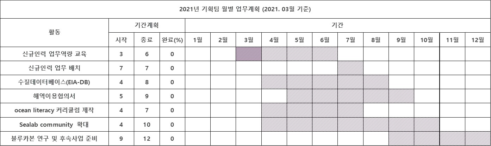

<!--HEADING-->

# github에 올릴 문서 제작 테스트 중

<!--line-->
---
# 텍스트 속성 이용
---
<!--텍스트 속성 이용-->

텍스트는 기호 없이 작성 시 작성 가능하다.

볼드체를 만들때에는 \*모양 2개를 양쪽에 감싸준다.

예를들면 **볼드체** 이다.

이탈릭체는 \*모양 1개를 양쪽에 감싸준다.

예를들면 *이탈릭체* 이다.

취소선을 만들때에는 ~모양 2개를 양쪽에 감싸준다.

예를들면 ~~취소선~~ 이다.

문장을 quote안에 넣으려면 >를 이용한다.

> quote안에 들어올 텍스트

---
# 문장부호 삽입
---
문장부호를 넣을 때는 \* 또는 - 또는 숫자를 이용한다.

- 문장부호
* 부호
1. 부호
2) 부호
3. 부호

---
# 링크삽입
---

<!--링크 삽입-->

- [dropboxtest](https://paper.dropbox.com/doc/2021.04.08--BIwSkR61tBwpoThD_BsQRC8xAg-e2y6gqlg27PnbWfn9Kwd6)

<!--이미지 삽입-->

| 이미지  | 설명                                                                       |
| ------- | -------------------------------------------------------------------------- |
| 웹이미지 | |
| PC이미지 ||


<!--표 삽입-->

- 표 예시
- 
| header | Description |
| ------ | ----------- |
| cell1 | cell2 |
| cell1 | cell2 |
| cell1 | cell2 |
| cell1 | cell2 |
| cell1 | cell2 |

<!--표에서 정렬-->

- 오른쪽 정렬한 표 만들기


| header | Description |
| -----: | ----------: |
|  cell1 |       cell2 |
|  cell1 |       cell2 |
|  cell1 |       cell2 |
|  cell1 |       cell2 |
|  cell1 |       cell2 |

- 양쪽 정렬
- 
|header|Description|
|:--:|:--:|
|cell1|cell2|
|cell1|cell2|
|cell1|cell2|
|cell1|cell2|
|cell1|cell2|

<!--문서 안에서 code 보여주기-->

문서안에서 code를 보여줄 때 `이것은 코드입니다`로 표현 가능하다.

코드 블럭을 만들 때에는

```py
inport padas as pd
```

로 작성할 수 있다.
