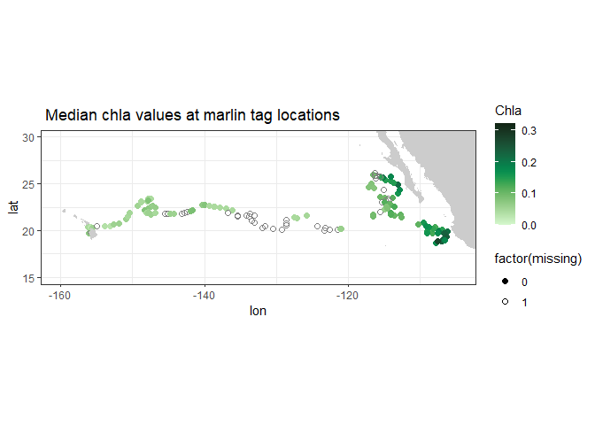
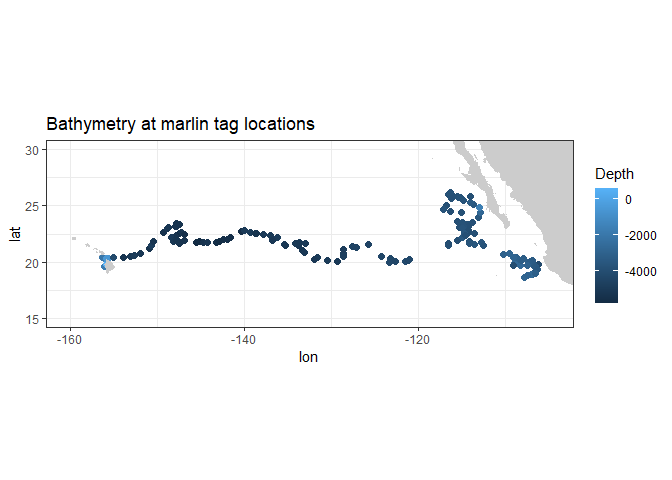

Using the xtractomatic routines version 3.4
================
true
2018-01-05

번역 <https://rmendels.github.io/Usingxtractomatic_3.4.0.nb.html>

`xtractomatic`는 원격서버로부터 위성 및 기타 해양데이터의 부분집합(subset)을 추출하기 위해 개발된 R
패키지이다. 이 프로그램은 사용자가 설정한 위도, 경도, 시간 포인트(예를 들어 3D의 범위설정(bounding
box)에 따라, 또는 시간이 경과하는 폴리곤 내)에 따라 시간의 이동포인트에 대한 데이터를 추출할 수 있다.
`xtractomatic`함수는 원래 해양생물 태깅 커뮤니티를 위해 개발되어, 다양한 태그(tagged) 동물 또는 선박경로로부터
데이터를 track하기(`xtracto) 위해 위성(해수면 온도, 해수면 클로로필, 해수면고도, 해수면 염분, 바람벡터)로부터
이용가능한 해양데이터를 매치업한다. 이후 패키지는 확장되어서 3D bounding box(`xtracto\_3D) 또는
폴리곤(`xtractogon`)으로 데이터를 추출하는 루틴들을 포함하였다. `xtractomatic`패키지는 캘리포니아
Santa Cruz, NOAA/SWFSC 환경연구부의 ERDDAP 서버를 통해 데이터에 접근한다. 사용자의 데이터 조회시 서버
과부하를 방지하기 위해서, 유용한 일부 데이터셋만이 지원된다. 또한 ERDDAP서버는
<http://coastwatch.pfeg.noaa.gov/erddap> 에서만 직접 접근할 수 있다. ERDDAP은 Bob
Simons에 의해 개발된 것으로, 사용이 간편하지만 강력한 웹 데이터 서비스이다. 본 `xtractomatic`는 세번째
버전으로, Kristen Thyng(참조: <http://matplotlib.org/cmocean/> and
<https://github.com/matplotlib/cmocean>) `cmocean` colormaps의 최근버전을 포함하고
있다. 이 컬러맵들은 초기에 파이썬으로 개발되었고, 그 중 한 버전이 Dan Kelley와 Clark Richards에 의해
`oce`패키지에 사용되었으나, 여기에 사용된 컬러맵은 2017년 버전이다. 컬러맵들은 `colors`로 자동 로드된다(참조
`str(colors)`). 몇가지 예제들을 `cmocean` colormaps에서 이용한다.

### 주요 xtractomatic 함수들

`xtractomatic` 패키지에는 세가지 주요 데이터 추출 함수들이 있다. - `xtracto <-
function(dtype, xpos, ypos, tpos = NA, xlen = 0., verbose=FALSE)` -
`xtracto_3D <- function(dtype, xpos, ypos, tpos = NA, verbose=FALSE)` -
`xtractogon <- function(dtype, xpos, ypos, tpos = NA, verbose=FALSE)`
`xtractomatic`패키지에는 두개의 중요 함수가 있다. - `searchData <-
function(searchList="varname:chl")` - `getInfo <- function(dtype)`

데이터 추출 루틴에서 `dtype`파라미터는 접근하는 ERDDAP 서버상의 데이터셋 조합과 데이터셋으로부터 파라미터를 지정한다.
첫 부분에서는 실제 설정에서 이 함수를 어떻게 사용하는지를 보여준다. 데이터 선택 부분에서는 이용가능한 데이터셋의
`dtype` 또는 기타 파라미터를 찾는 방법을 보여준다.

## Setting up

`xtractomatic`은 `httr`, `ncdf4`, `readr`, `sp` 패키지들을 사용하기 때문에 이 패키지들이 먼저
설치되어야하며, 그렇지 않으면 `xtractomatic` 설치가 안된다.

``` r
#install.packages("httr", dependencies = TRUE)
#install.packages("ncdf4",dependencies = TRUE) 
#install.packages("readr", dependencies = TRUE)
#install.packages("sp", dependencies = TRUE)
```

`xtractomatic` 패키지는 CRAN에서 이용가능하며 다음과 같이 설치한다.

``` r
#install.packages("xtractomatic")
```

또는 개발버전 [Github](https://github.com/rmendels/xtractomatic)을 이용할 수 있으며,
다음과 같이 설치한다.

``` r
#install.packages("devtools")
#devtools::install_github("rmendels/xtractomatic")
```

설치후 다음과 같이 라이브러리를 불러온다.

``` r
library("xtractomatic")
```

기타 라이브러리들(`httr`, `ncdf4`, `readr`, `sp`)이 설치되었다면, 명시적으로 불러올 필요는 없다.

## R 코드 예제를 이용하기

`xtractomatic` 패키지외에, 아래 예제는 `DT`, `ggplot2`, `lubridate`, `mapdata`,
`reshape2`에 의존한다. 따라서 먼저 이들 패키지를 불러온다.

``` r
library("DT")
library("ggplot2")
library("lubridate")
```

    ## 
    ## Attaching package: 'lubridate'

    ## The following objects are masked from 'package:base':
    ## 
    ##     date, intersect, setdiff, union

``` r
library("mapdata")
```

    ## Loading required package: maps

``` r
library("reshape2")
```

다른 코드예제에서 사용되는 몇가지 함수가 문서에서 정의된다. 여기에는 `chlaAvg`, `upwell`,
`plotUpwell`이 있다.

## Getting Started

### An xtracto example

본 예제에서는 *Marlintag38606* 데이터셋(태평양에서 태깅된 marlin의 트랙 데이터셋)에서 발견되는 트랙라인을 따라
데이터를 추출하고, 이를 몇개의 간단한 플롯으로 그려본다.

``` r
require(xtractomatic)
str(Marlintag38606)
```

    ## 'data.frame':    152 obs. of  7 variables:
    ##  $ date  : Date, format: "2003-04-23" "2003-04-24" ...
    ##  $ lon   : num  204 204 204 204 204 ...
    ##  $ lat   : num  19.7 19.8 20.4 20.3 20.3 ...
    ##  $ lowLon: num  204 204 204 204 204 ...
    ##  $ higLon: num  204 204 204 204 204 ...
    ##  $ lowLat: num  19.7 18.8 18.8 18.9 18.9 ...
    ##  $ higLat: num  19.7 20.9 21.9 21.7 21.7 ...

*Marlintag38606* 데이터셋은 *date*, *longitude*, *latitude*의 3가지 값으로 구성되는데,
이는 `xtracto`에서 *xpos*, *ypos*, *tpos* 인자로 사용된다. 파라미터 *xlen*과 *ylen*은
존재하는 데이터에 대하여 조회를 위한 포인트 주변의 공간적 “radius”(실제로는 circle이 아닌 box)를 지정한다.
이들은 시간 종속적 벡터값으로 입력될 수 있지만, 여기서는 0.2도 설정값으로 사용된다. 본 예제는 8 day
composite 데이터셋인 *SeaWiFS chlorophyll data*를 추출한다. 이 데이터셋은 `xtracto` 함수에서
“swchla8day”의 `dtype`으로 지정된다. 다음의 섹션에서는 그밖의 여러가지 위성데이터셋에 접근하는 방법을 설명한다.

``` r
require(xtractomatic)

# First we will copy the Marlintag38606 data into a variable 
# called tagData  so that subsequent code will be more generic.  

tagData <- Marlintag38606
xpos <- tagData$lon
ypos <- tagData$lat
tpos <- tagData$date
swchl <- xtracto("swchla8day", xpos, ypos, tpos = tpos, , xlen = .2, ylen = .2)
```

``` r
str(swchl)
```

    ## 'data.frame':    152 obs. of  11 variables:
    ##  $ mean chlorophyll  : num  0.073 NaN 0.074 0.0653 0.0403 ...
    ##  $ stdev chlorophyll : num  NA NA 0.00709 0.00768 0.02278 ...
    ##  $ n                 : int  1 0 16 4 7 9 4 3 0 6 ...
    ##  $ satellite date    : chr  "2003-04-19" "2003-04-27" "2003-04-27" "2003-04-27" ...
    ##  $ requested lon min : num  204 204 204 204 204 ...
    ##  $ requested lon max : num  204 204 204 204 204 ...
    ##  $ requested lat min : num  19.6 19.7 20.3 20.2 20.2 ...
    ##  $ requested lat max : num  19.8 19.9 20.5 20.4 20.4 ...
    ##  $ requested date    : num  12165 12166 12172 12173 12174 ...
    ##  $ median chlorophyll: num  0.073 NA 0.073 0.0645 0.031 ...
    ##  $ mad chlorophyll   : num  0 NA 0.00297 0.00741 0.0089 ...

## 결과 그리기

포인트 주변의 위성 클로로필의 평균을 따라 색깔이 입혀진 위치점으로 트랙라인을 플롯팅한다. 태그 위치지만 클로로필값이 없는 위치
또한 보인다.

``` r
require(ggplot2)
```

``` r
require(mapdata)
```

``` r
# First combine the two dataframes (the input and the output) into one, 
# so it will be easy to take into account the locations that didn’t 
# retrieve a value.
alldata <- cbind(swchl, tagData)
# adjust the longitudes to be (-180,180)
alldata$lon <- alldata$lon - 360
# Create a variable that shows if chla is missing
alldata$missing <- is.na(alldata$mean) * 1
colnames(alldata)[1] <- 'mean'
# set limits of the map
ylim <- c(15, 30)
xlim <- c(-160, -105)
# get outline data for map
w <- map_data("worldHires", ylim = ylim, xlim = xlim)
# plot using ggplot
myColor <- colors$algae
z <- ggplot(alldata,aes(x = lon, y = lat)) + 
   geom_point(aes(colour = mean, shape = factor(missing)), size = 2.) + 
   scale_shape_manual(values = c(19, 1))
z + geom_polygon(data = w, aes(x = long, y = lat, group = group), fill = "grey80") + 
  theme_bw() + 
  scale_colour_gradientn(colours = myColor, limits = c(0., 0.32), "Chla") + 
  coord_fixed(1.3, xlim = xlim, ylim = ylim) + ggtitle("Mean chla values at marlin tag locations")
```

<!-- -->

## 중앙값과 비교하기

`xtracto` 루틴은 주어진 위치주변의 box(`xlen`과 `ylen`으로 정의)에서 환경데이터를 추출하고 그 box 내의
데이터 통계값을 계산한다.

``` r
require(ggplot2)
colnames(alldata)[10] <- 'median'
# plot using ggplot
myColor <- colors$algae   # 패키지 cmocean color palette
z <- ggplot(alldata,aes(x = lon,y = lat)) + 
   geom_point(aes(colour = median,shape = factor(missing)), size = 2.) + 
  scale_shape_manual(values = c(19, 1))
z + geom_polygon(data = w, aes(x = long, y = lat, group = group), fill = "grey80") + 
  theme_bw() + 
  scale_colour_gradientn(colours = myColor, limits = c(0., 0.32), "Chla") + 
  coord_fixed(1.3, xlim = xlim, ylim = ylim) + ggtitle(" Median chla values at marlin tag locations")
```

<!-- -->

### 지형 데이터

위성데이터 뿐만아니라, `xtractomatic`은 지형데이터에 접근할 수 있다. 예제처럼 트랙라인과 연관된
수심(bathymetry)을 추출하고 플롯팅한다. 트랙을 따라 지형데이터을 획득한다.

``` r
require("xtractomatic")
ylim <- c(15, 30)
xlim <- c(-160, -105)
topo <- xtracto("ETOPO180", tagData$lon, tagData$lat, xlen = .1, ylen = .1)
```

그리고 트랙을 플롯팅한다.

``` r
require("ggplot2")
alldata <- cbind(topo, tagData)
alldata$lon <- alldata$lon - 360
colnames(alldata)[1] <- 'mean'
z <- ggplot(alldata, aes(x = lon,y = lat)) + 
   geom_point(aes(colour = mean), size = 2.) + 
  scale_shape_manual(values = c(19, 1))
z + geom_polygon(data = w, aes(x = long, y = lat, group = group), fill = "grey80") + 
  theme_bw() + 
  scale_colour_gradient("Depth") + 
  coord_fixed(1.3, xlim = xlim, ylim = ylim) + ggtitle("Bathymetry at marlin tag locations")
```

<!-- -->

### 태그된 데이터 읽기

위의 예제는 이미 R 포맷으로 전환된 데이터를 사용한다. 하지만 `xtracto` 함수의 유용성은 사용자가 가진 데이터셋과 함께
ㅅ용하는데 있다. 이 데이터셋은 *Marlin-tag38606.txt*라는 텍스트 파일로부터 읽혀졌는데, 이는
`xtractomatic` 패키지가 불려졌을 때 이용가능한 것이다. 이 파일을 이용하기 위해서

``` r
#system.file("extdata", "Marlin-tag38606.txt", package = "xtractomatic")
```

이 파일의 첫 다섯 라인을 보면;

``` r
datafile <- system.file("extdata", "Marlin-tag38606.txt", package = "xtractomatic")
#system(paste("head -n5 ", datafile))
```

그리고 다음과 같이 읽어온다:

``` r
Marlingtag38606 <- read.csv(datafile, head = TRUE, stringsAsFactors = FALSE, sep = "\t")
```

``` r
str(Marlingtag38606)
```

    ## 'data.frame':    152 obs. of  7 variables:
    ##  $ date  : chr  "4/23/2003" "4/24/2003" "4/30/2003" "5/1/2003" ...
    ##  $ lon   : num  204 204 204 204 204 ...
    ##  $ lat   : num  19.7 19.8 20.4 20.3 20.3 ...
    ##  $ lowLon: num  204 204 204 204 204 ...
    ##  $ higLon: num  204 204 204 204 204 ...
    ##  $ lowLat: num  19.7 18.8 18.8 18.9 18.9 ...
    ##  $ higLat: num  19.7 20.9 21.9 21.7 21.7 ...

파일 Marlingtag38606.txt는 “tab”으로 분리된 파일로, 콤마로 분리된 파일이 아니므로 `read.csv`함수의
`sep` 옵션은 이를 지사하고있으며, `stringAsFactors = FALSE`는 이 함수가 factor로 날짜(date)를
취급하지 않음을 말한다. 이제 예를 들어 `4/23/2003`으로 포맷된 날짜 필드를 이용할 수 있도록 R날짜 필드로 전환할
필요가 있다:

``` r
Marlintag38606$date <- as.Date(Marlintag38606$date, format='%m/%d/%Y')
```

파일의 날짜가 `as.Date`로 인식되는 포맷이 아니기 때문에 날짜 포맷으로 만들어야 한다. 소문자 y(%y)는 year가
두자릿수(97)를 가지며, 대문자 Y(%Y)는 year가 네 자릿수(1997)을 표시한다. 만약 소수점으로 콤마와
필드구분자로 세미콜론을 가지는 EU포맷인 경우에는 read.csv보다는 read.csv2를 사용한다. 이 데이터셋은
위경도에 대한 95% 신뢰구간의 범위를 포함하는데, 데이터의 마지막 네개의 컬럼에 있다. 조회 “radius”가 읽혀진
위의 예제에서 `xtracto`는 0.2도의 상수값이지만, 벡터 또한 읽혀질 수 잇다. 파일에서 주어진 제한값을 사용하기
위해서는 다음과 같이 벡터를 생성한다.

``` r
xrad <- abs(Marlintag38606$higLon - Marlintag38606$lowLon)
yrad <- abs(Marlintag38606$higLat - Marlintag38606$lowLat)
```

그 다음엔 `xtracto`의 입력값 `xlen`과 `ylen`으로 이것들을 이용한다.

``` r
xpos <- Marlintag38606$lon 
ypos <- Marlintag38606$lat 
tpos <- Marlintag38606$date
swchl <- xtracto(xpos, ypos, tpos, "swchla8day", xrad, yrad)
```

    ## [1] "input vectors are not of the same length"
    ## [1] "length of xpos: 152"
    ## [1] "length of ypos: 152"
    ## [1] "length of tpos: 1"

### `xtracto_3D` 이용하기


