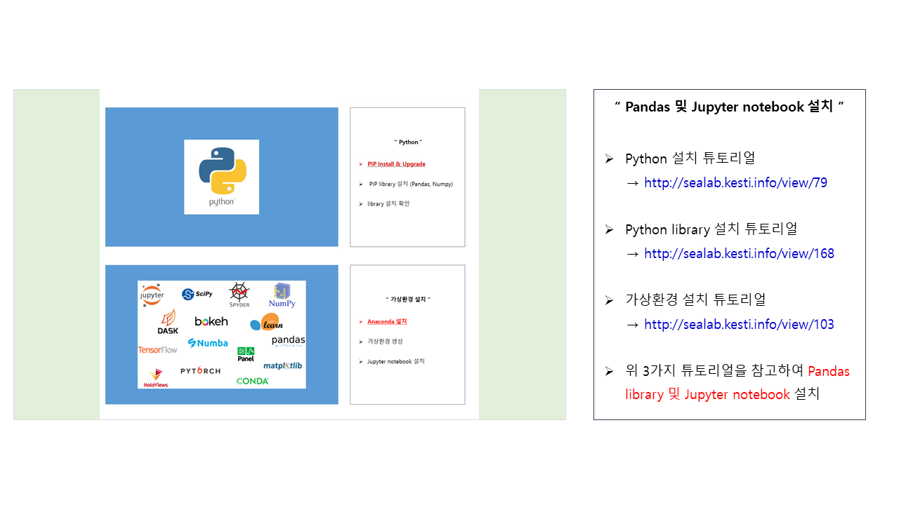

# 시계열 자료를 활용하여 빅데이터 분석하기 1편

이번 포스트는 실제 `시계열 자료`를 통해 **빅데이터를 분석하고, 예측해보는 시간**을 갖겠습니다. 
 
 
**1편**에서는 주제 선정 및 데이터 수집, 데이터 전처리까지 다룰 예정이며, 추후에 `EDA 분석`과 가능하다면 `딥러닝 모델인 LSTM`도 소개해볼 예정입니다.

### 본 포스트에 사용된 링크 모음
[부동산통계뷰어 R-ONE 바로가기 링크](http://www.r-one.co.kr/)
 
[Python 설치 포스트 바로가기 링크](http://sealab.kesti.info/view/79)
 
[Python library 설치 포스트 바로가기 링크](http://sealab.kesti.info/view/168)
 
[가상환경 설치 포스트 바로가기 링크](http://sealab.kesti.info/view/103)
