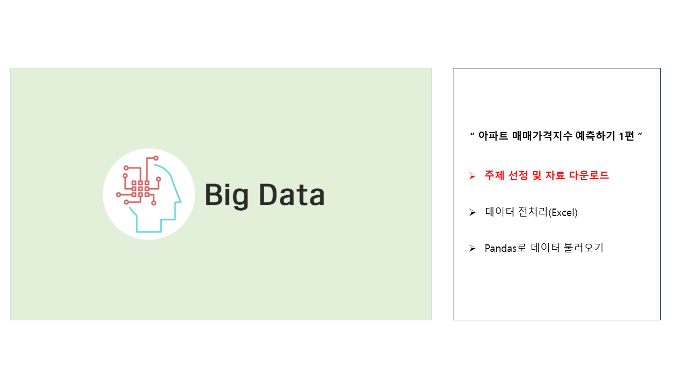
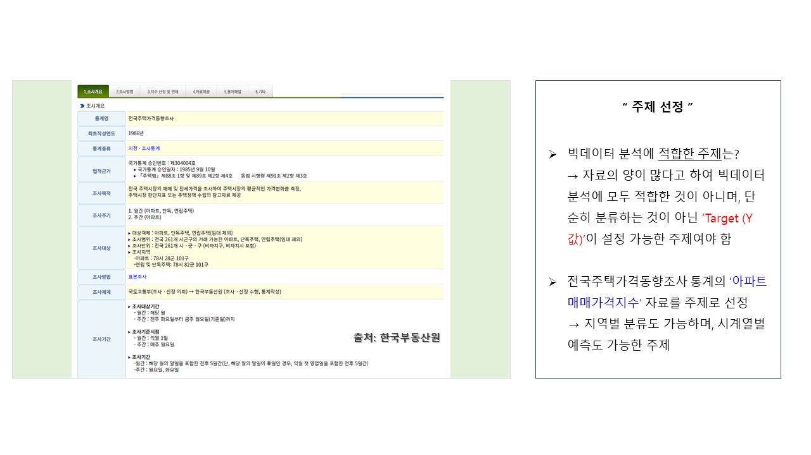
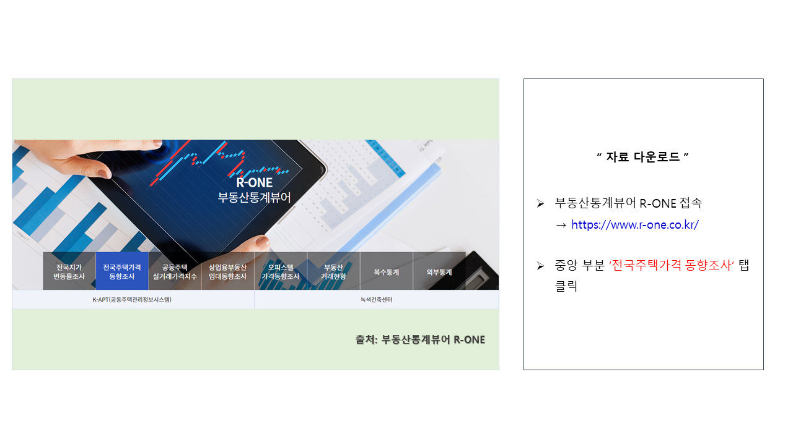
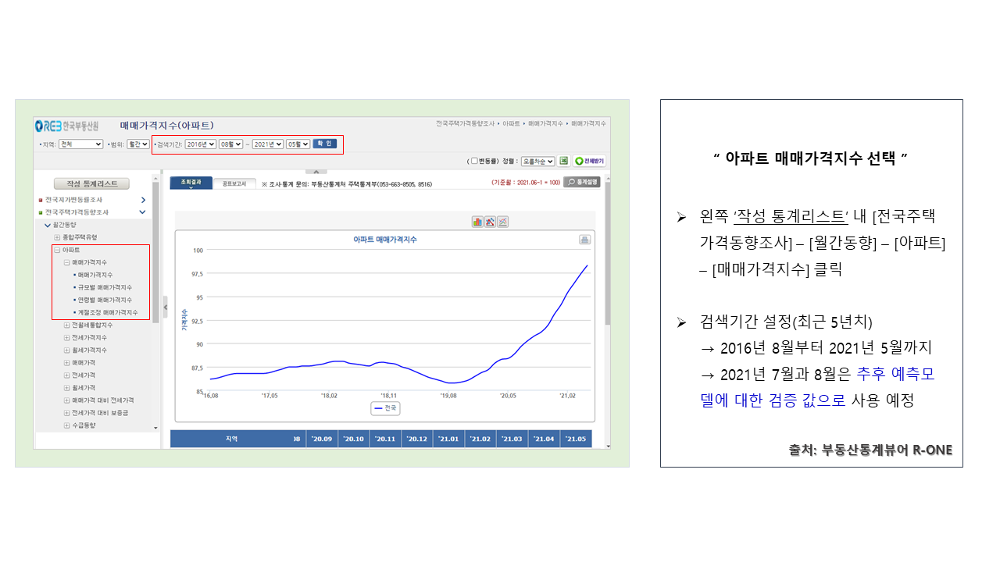
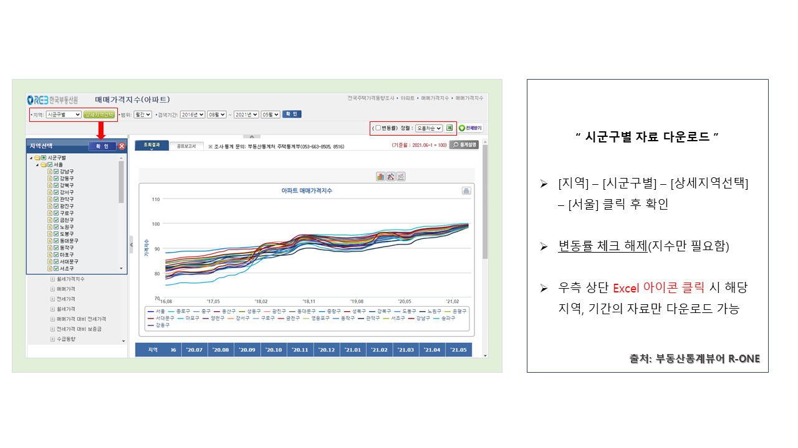

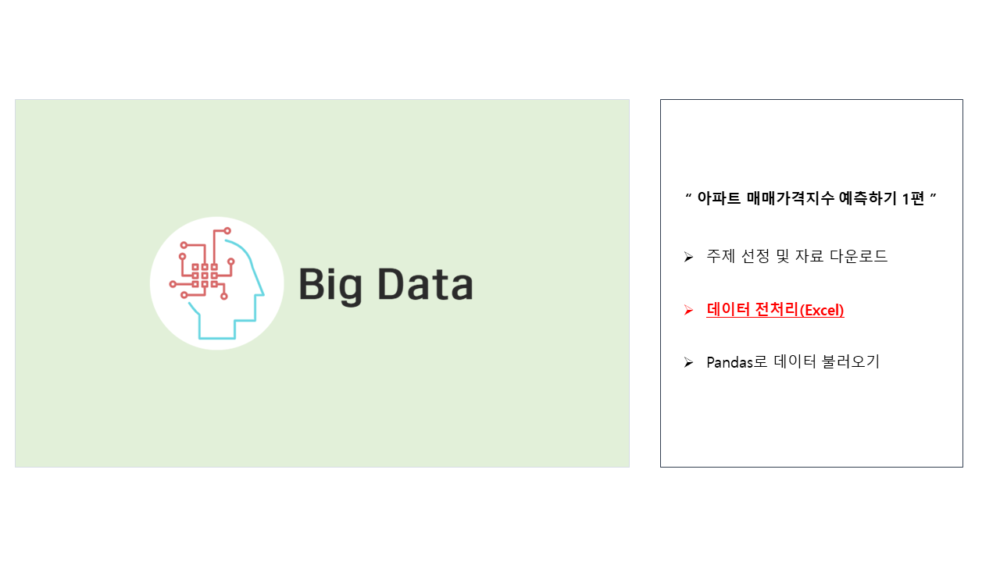
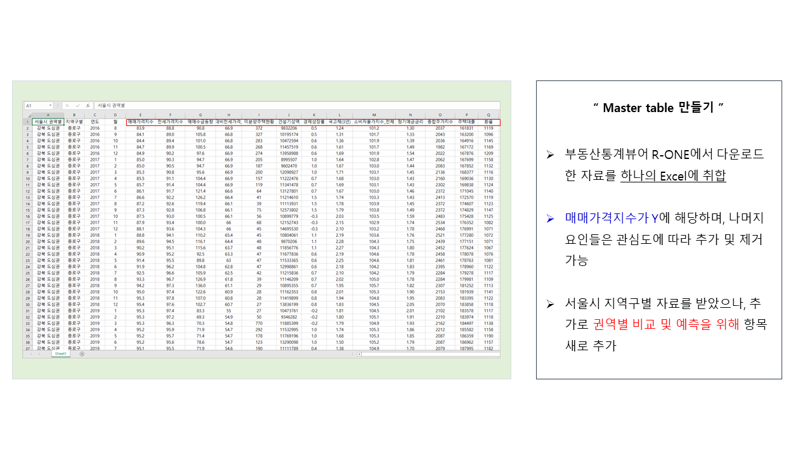
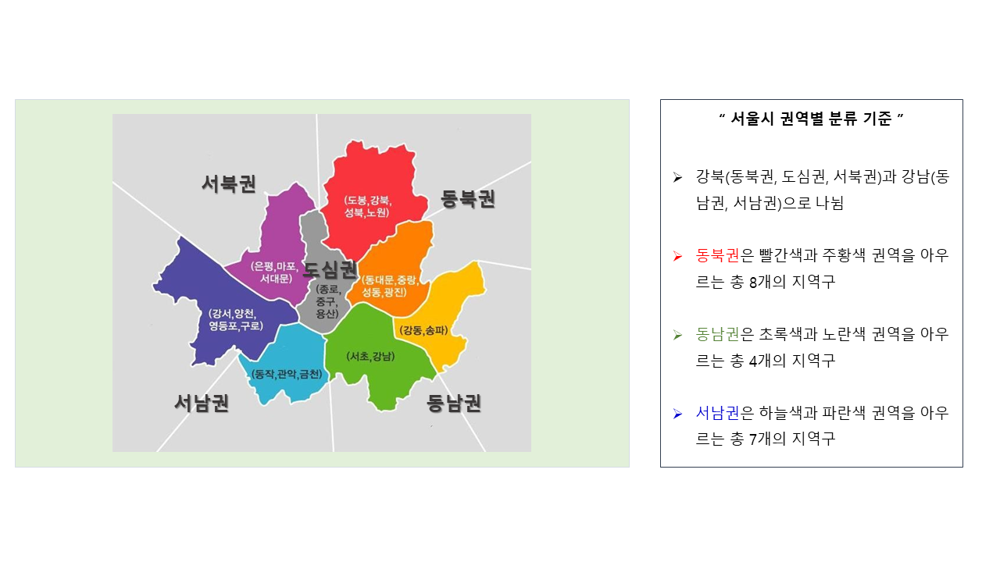
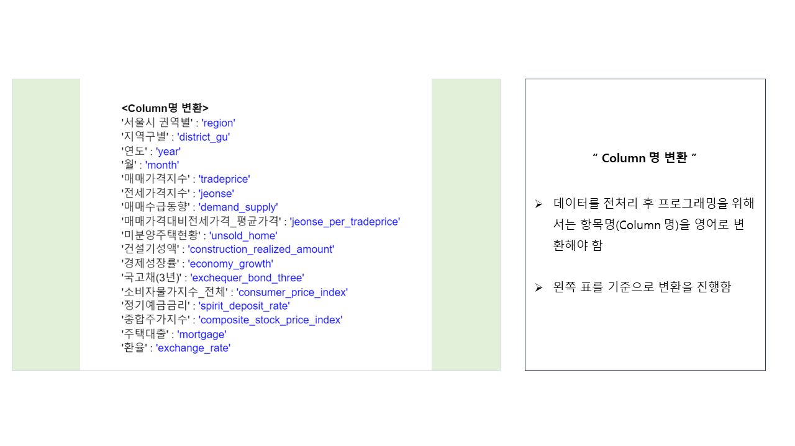
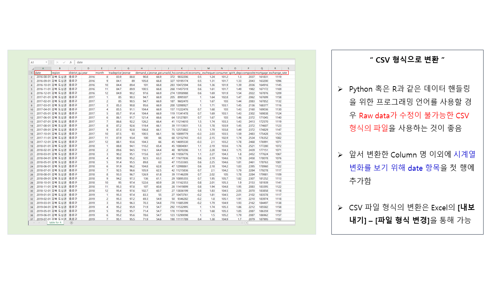
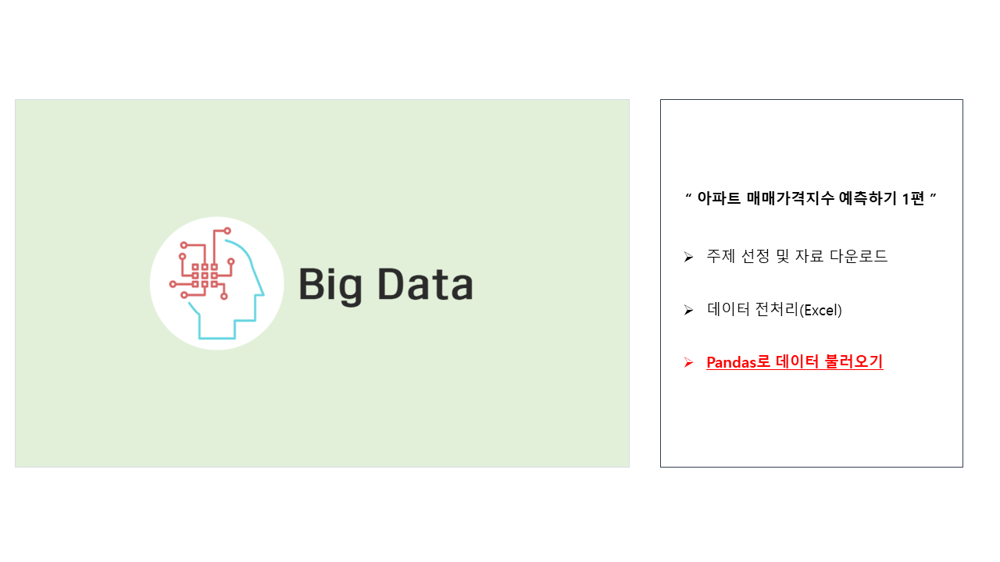
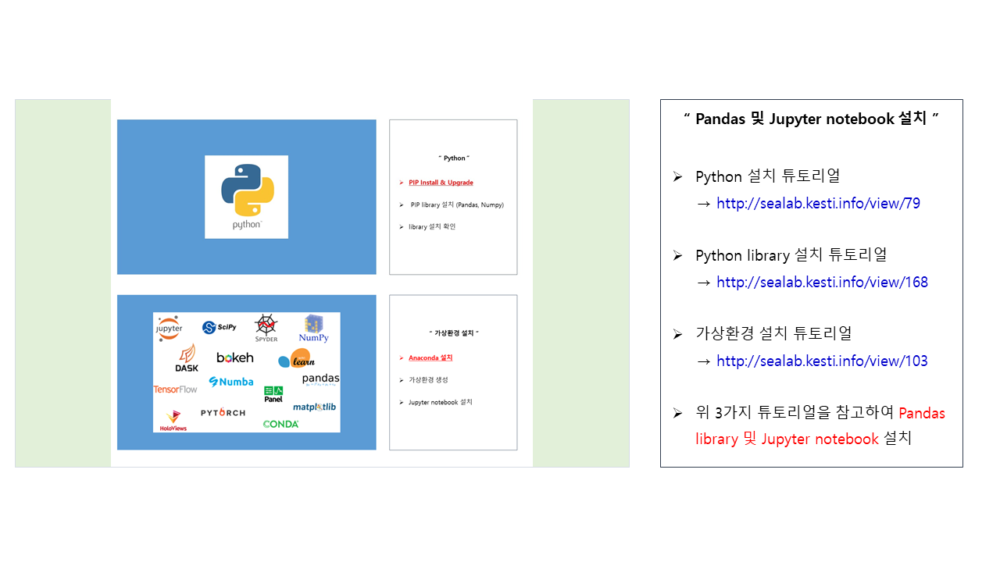
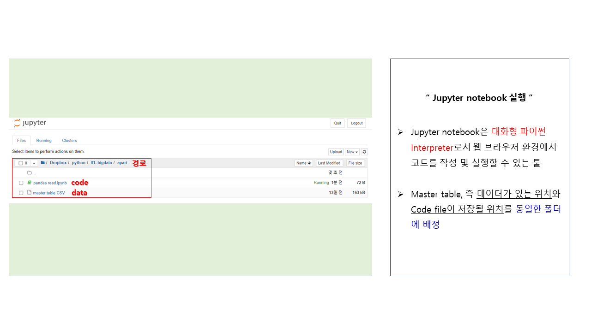
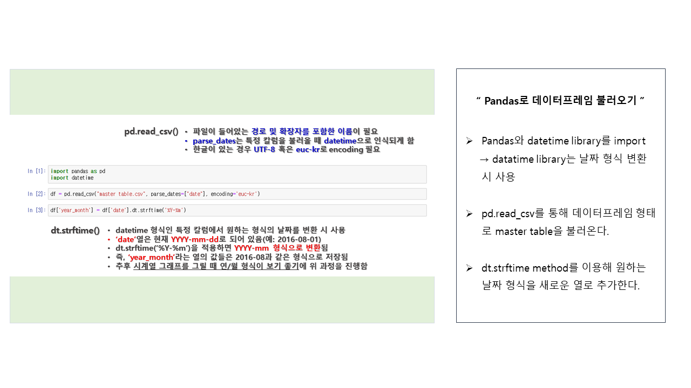
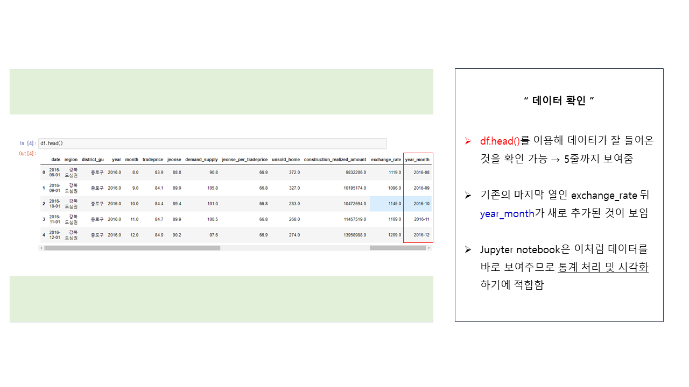
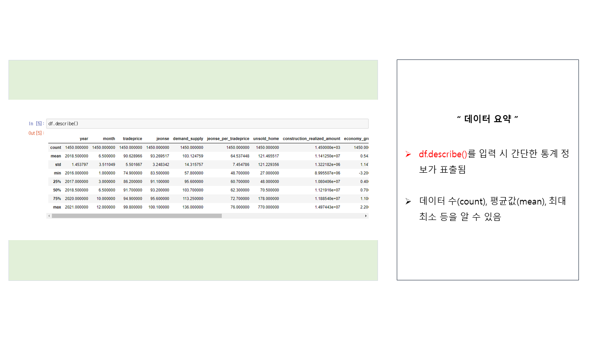
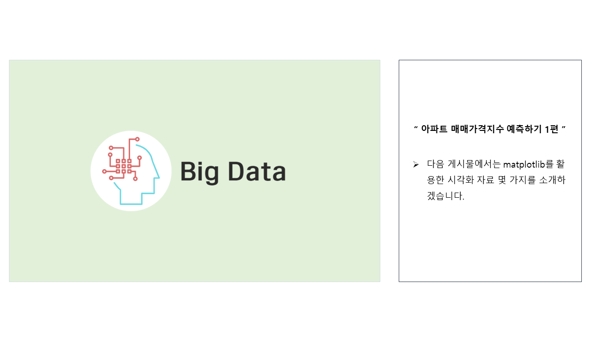

### 본 포스트에 사용된 링크 모음
[부동산통계뷰어 R-ONE 바로가기 링크](http://www.r-one.co.kr/)
 
[Python 설치 포스트 바로가기 링크](http://sealab.kesti.info/view/79)
 
[Python library 설치 포스트 바로가기 링크](http://sealab.kesti.info/view/168)
 
[가상환경 설치 포스트 바로가기 링크](http://sealab.kesti.info/view/103)
