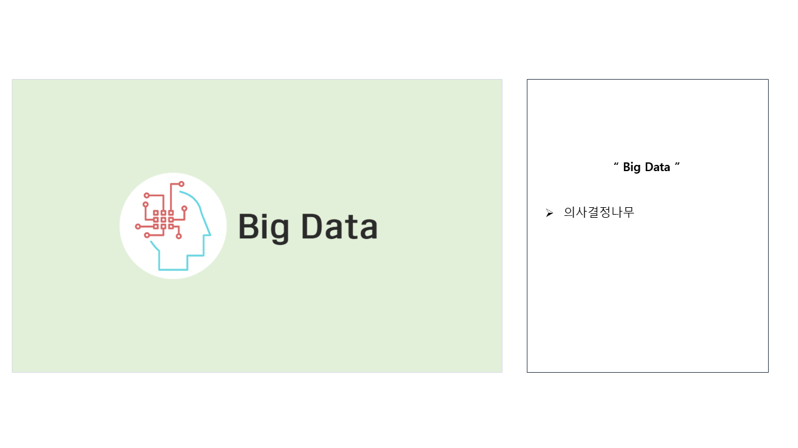
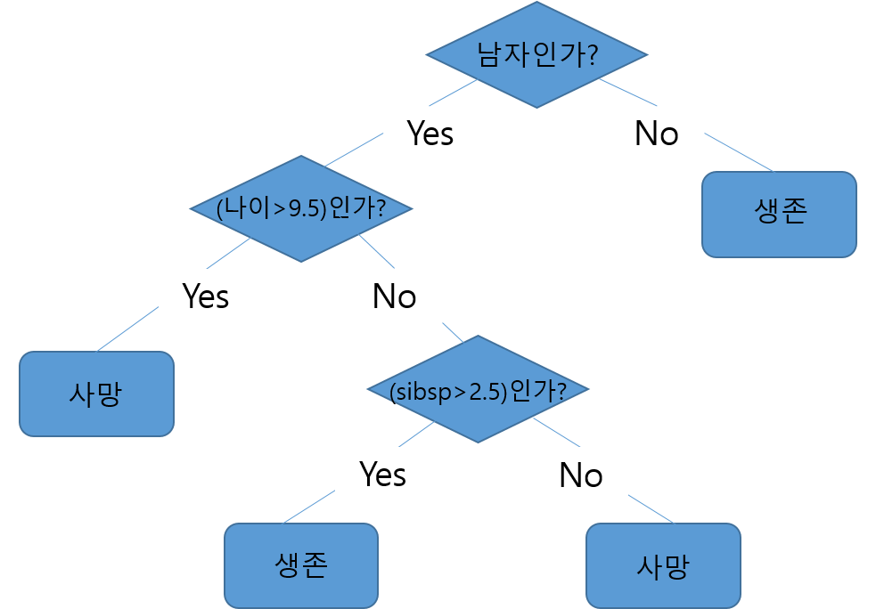
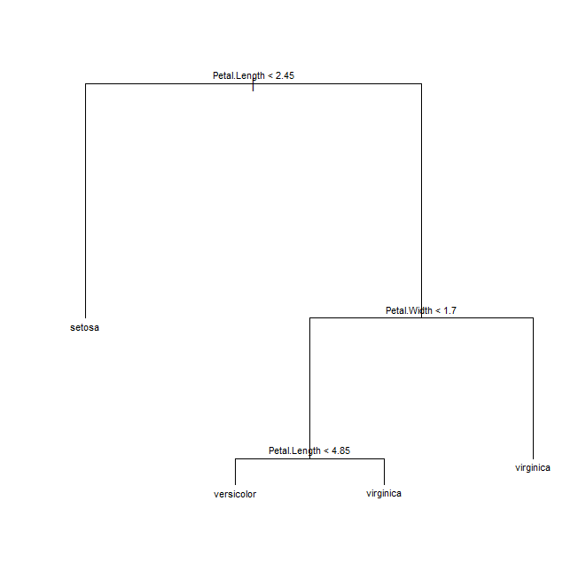
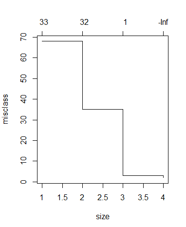
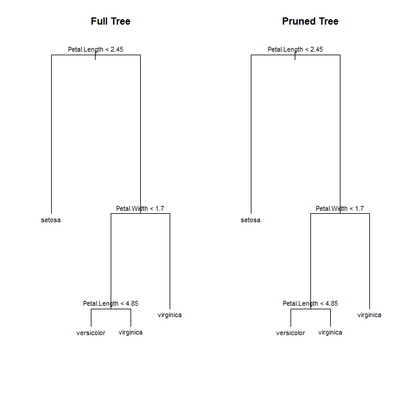

# 의사결정나무(Decision Tree)



**의사결정나무(Decision Tree)는** 데이터를 나무구조로 도표화하여 분석하는 방식으로 `분류`와 `회귀분석`에 주로 이용됩니다.
아래 그림은 의사결정나무를 이용하여 **타이타닉 호의 생존자**를 분석한 그림입니다.

<br>



<br>
<br>
<br>
<br>

## R에서 의사결정나무를 사용하기 위해서는 세 가지 패키지를 이용할 수 있습니다.

<br>

**1) Tree 패키지 & rpart 패키지**
<br>
Tree 패키지는 binary recursive partitioning 방법론을 사용하고, rpart 패키지는 CART (classification and regresstion trees) 방법론을 사용합니다.
이 패키지들은 연산 속도가 빠르지만 과적합의 위험성이 존재하므로 Pruning(가지치기)과정을 거쳐서 최적화를 해야 합니다.

<br>

**2) Party 패키지**
<br>
Unbiased recursive partitioning based on permutation tests 방법론을 사용합니다.
별도로 pruning(가지치기)과정을 거칠 필요가 없다는 장점이 있으나, 입력할 수 있는 변수가 31개로 제한되어 있다는 단점이 있습니다.

<br>

오늘은 `tree 패키지`를 사용하여 **R에 내장된 iris 데이터를 가지고** 의사결정나무를 수행해보겠습니다.

<br>
<br>
<br>

### 1. 데이터 불러오기

<br>

```r
data(iris)
str(iris)

set.seed(101)
sample.num <- sample(1:nrow(iris), 0.7*nrow(iris))
train <- iris[sample.num,]
test <- iris[-sample.num,]
```

<br>

- data( ) 함수를 이용하여 Iris 데이터를 불러옵니다. Iris는 R에서 제공하는 기본 데이터이므로 data( ) 함수만 이용해도 데이터를 불러올 수 있습니다. 
- str( ) 함수를 이용하여 데이터의 변수, 타입, 개수 등을 먼저 파악합니다.
- sample( ) 함수로 train 데이터와 test 데이터를 7:3의 비율로 분리합니다.

<br>
<br>

### 2. Tree 그리기

<br>

```r
install.packages("tree")
library(tree)

tree_iris  <-tree(Species~., data=train)
tree_iris
summary(tree_iris)

dev.new()

plot(tree_iris)
text(tree_iris, cex = 0.7)
```

<br>

- tree 패키지를 사용하기 위해서는 가장 먼저 패키지 설치가 필요합니다. 패키지는 처음 한 번에 설치하면, 계속 사용할 수 있고 사용할 때마다 library 함수를 이용하여 패키지를 불러와야 합니다.
- tree(Species~., data=train)은 train 데이터를 이용하여 species를 포함한 모든 변수를 가지고 tree를 그리겠다는 의미입니다.
- dev.new( ) 함수는 이미지를 새 창에 띄워서 확인할 수 있도록 합니다.
- plot( ) 함수를 이용하여 그려진 tree를 시각화할 수 있고, text( ) 함수를 이용하여 node별 변수를 표출할 수 있습니다. Cex는 글씨 크기를 의미하므로 숫자를 변경하여 원하는 크기로 적절하게 조절이 가능합니다.
- 아래는 **가지치기 전** tree 그림입니다.

<br>



<br>

### 3. 가지치기

<br>

```r
tree_p <- prune.misclass(tree_iris)
plot(tree_p)
tree_p  <- prune.misclass(tree_iris, best=4)
plot(tree_p)
text(tree_p, cex = 0.7)
```

<br>

- tree 패키지는 과적합이 일어날 확률이 높기 때문에 가지치기 과정이 필요합니다.
- prune.misclss( ) 함수를 이용하여 가장 적합한 size를 확인합니다. 여기서는 가장 적합한 size가 4로 보여집니다.

<br>
<br>

<가치치기 code에서 `2번째 line까지 돌렸을 때` 그림>

<br>



<br>
<br>
<br>

<가지치기 code에서 `마자막 line까지 돌렸을 때`, 즉 가지치기 후 그림>


<br>
<br>

### 4. Tree 비교하기

<br>

```r
par(mfrow=c(1,2))

#가지치기 안한 Tree
plot(tree_iris)
title(main="Full Tree", cex.main = 1)
text(tree_iris,cex=0.7)

#가지치기한 Tree
plot(tree_p)
title(main="Pruned Tree", cex.main = 1)
text(tree_p, cex=0.7)
```

<br>

- 가지치기를 하지 않은 tree와 가지치기를 수행한 tree를 한 번에 비교해 볼 수 도 있습니다.
- par( ) 함수는 그래픽 환경을 지정할 수 있는 함수입니다. 두 개의 이미지를 같이 볼 수 있도록 설정합니다.
- **아래는 Tree를 비교한 그림**

<br>



<br>
<br>

### 5. Tree 예측

<br>

```r
yhat  <- predict(tree_p, newdata=test, type="class")
ytest <- test$Species
table(yhat,ytest)

cat("오분류율 = ", mean(yhat!=ytest)*100,"%")
```

<br>

- predict( ) 함수를 사용하여 train 데이터 대신 test 데이터로 tree를 예측해보고, 얼마나 정확하게 그려졌는지 확인할 수 있습니다.
- table( ) 함수를 이용하여 나온 결과를 해석해보면 virginica가 versicolor로 잘못 분류되는 게 3개라는 의미입니다.
- cat( ) 함수로 오분류율을 구해봅니다.

<br>
<br>

### 결론) iris 데이터의 경우 변수가 적고 데이터가 단순합니다. 따라서 과적합이 생기지 않았고, 가지치기 전 tree와 가지치기 후의 tree가 같은 것도 이러한 이유입니다.

<br>
