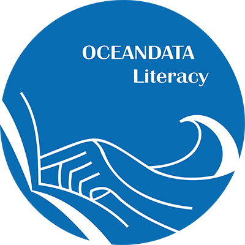
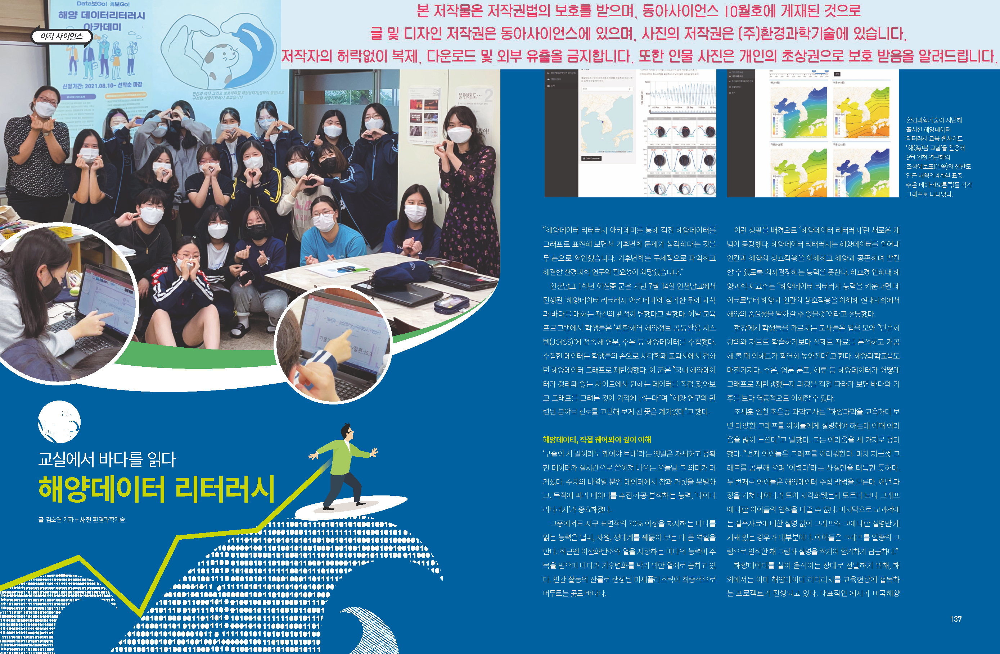
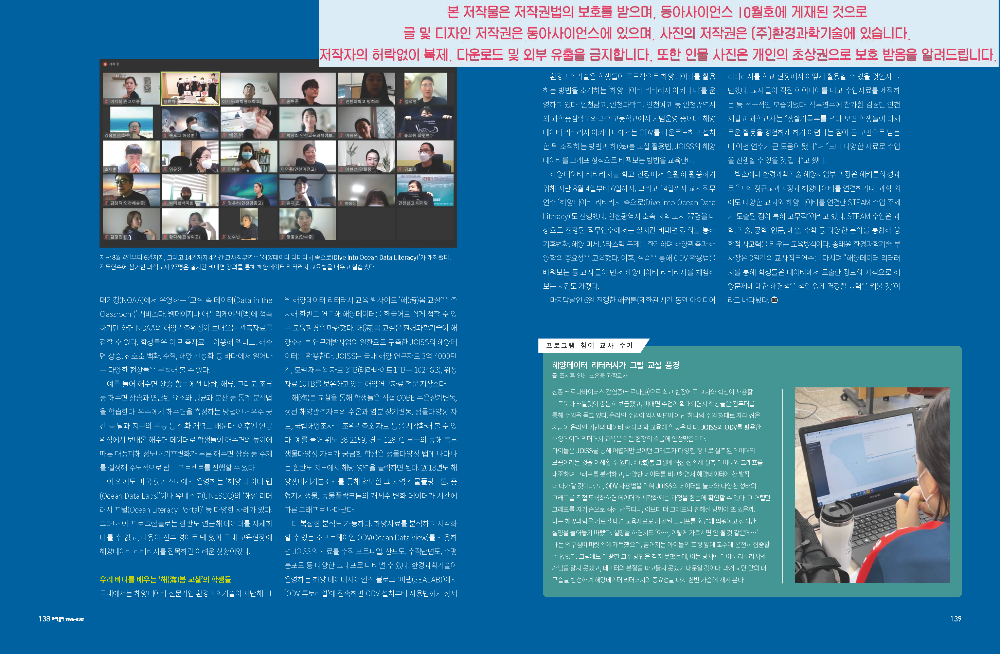

## 해양데이터리터러시 교육 프로그램 [동아사이언스 2021년 10월호 게재]

(주)환경과학기술에서는 해양데이터리터러시에 대한 이해도를 높이기 위하여 다양한 교육프로그램을 운영하고 있습니다. 

이번 2021년 10월 동아사이언스에 해양데이터리터러시 교육프로그램에 관한 기사가 아래와 같이 게재되었습니다. 

보다 자세한 사항은 SEALAB 콘텐츠 '해양데이터리터러시 교육 안내' 를 참고해 주십시오. 

동아리 수업 신청, 협력 및 문의사항이 있으실 경우 언제든지 연락해주십시오. 

해양데이터리터러시 프로그램이 학교 및 차세대 해양과학교육에 많은 도움이 되기를 바랍니다.

>contact us
>
>joiss.kesti@gmail.com
>
>(주)환경과학기술 08501 서울특별시 금천구 가산디지털1로 205 KCC웰츠밸리 403호
>
>Tel_ 02-2113-0705

<주의>

본 저작물은 저작권법의 보호를 받으며, 저작권은 동아사이언스와 (주)환경과학기술에 있습니다. 

저작자의 허락 없이 상영, 복제, 다운로드 및 외부 사이트 유출을 금지합니다. 

또한 인물 화면은 개인의 초상권으로 보호 받음을 알려드립니다.

